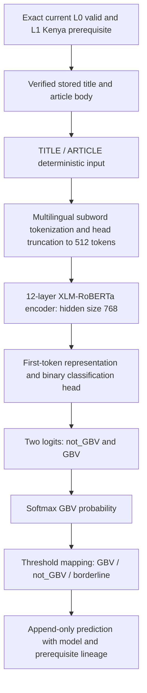

# Automated Annotation Pipeline

## 1. Purpose and scope

This document is the technical and research reference for L0 extraction quality,
L1 Kenya relevance and L2 GBV relevance infrastructure (Section 21). It describes executable
behavior, initial engineering parameters, reproducibility, and validation limits.
Collection and annotation are separate: existing collectors and publisher parsers
do not invoke annotations automatically.

For thesis methodology, describe L0 as **deterministic rule-based
extraction-quality automated annotation** and L1 as a **versioned hybrid
geographic-evidence relevance scorer**. Both are automated pre-annotation and
eligibility layers. L1 combines lexical evidence classes through deterministic
scoring; it is not a trained AfroXLMR/XLM-R classifier and does not implement NER.
Engineering execution, human validation and model training are distinct stages.

Automated annotations are not gold labels. Human validation, reference labels and
adjudicated labels must remain logically separate from automated outputs. Their
L0/L1/L2 local human-validation storage/workflows are described in Section 20.
L2 provides separate bootstrap and model infrastructure with protected human review.
L3–L5 remain future work.

Technical authority is the current source code, SQL migration and regression
tests. [AI_CONTEXT.md](AI_CONTEXT.md) provides orientation; [the root
README](../README.md) provides setup/quick-start instructions;
[IMPLEMENTATION_STATUS.md](roadmap/IMPLEMENTATION_STATUS.md) records dated runs and
observations. The public Sheet governs planning and stage gates, not executable
behavior. The latest anonymous synchronization on 5 October 2026 refreshed all
four snapshots. It now supports an initial L2 development model on the current
usable corpus, iterative retraining toward ≥5,000 articles, and independent
held-out human evaluation; class support and validation gates remain open.
The previous synchronization on 4 October 2026 refreshed Roadmap, Current State
and Stage Gates; Annotation Layers was current. The synchronized Sheet now
records the 536-version execution scope, completed L0/L1 v2 automation and L2
weak/training/review infrastructure. Its weak-label totals remain 7/15/302; human
corrections are separate and do not rewrite those automated counts. Its L1
NER/classifier wording remains broader than this explicitly scoped deterministic
gazetteer enhancement. Sampled-validation exit gates remain open.

### L2 operational milestone closed — 6 October 2026, 00:04 EAT

**L2 DEVELOPMENT MODEL COVERAGE is complete: 324/324
compatible predictions, zero pending.** Final model labels are
**gbv 11 / not_gbv 307 / borderline 6**.
This closes operational coverage, not the L2 research-validation gate.

The read-only baseline used the same documented development database configured
by repository-local `.env`: PostgreSQL/psycopg, Supabase session pooler
`aws-1-eu-west-1.pooler.supabase.com:5432`, database `postgres`. No production
configuration was used. Baseline: 536 article versions; L0 valid 519/review 17;
L1 v2 kenya 324/not_kenya 35/ambiguous 160; model 300/324 with 10/284/6 and 24 pending.
Original weak counts were 7/15/302, effective weak view 10/312/2; human-validation
rows were L1 1 and L2 302 (303 total). Those upstream/human records were preserved.

**Artifact verified unchanged:** `l2-afroxlmr-dev-v1`, method
`l2-47035d92f81cd5240062610d`, the existing binary order and 0.8/0.2 engineering
thresholds. Manifest, config, tokenizer and safetensors checksums passed; offline
local-files-only reload with remote code disabled, `eval()` and a synthetic
`inference_mode()` forward pass succeeded. The validation reload took
3.338 seconds on cpu; this is a separate artifact check,
not model-load timing from the resume runs. No data regeneration, retraining,
new model identity, tokenizer change or threshold tuning occurred.

**Migration:** preflight inspected all 624 historical L2 weak/model rows. Invalid
labels, NULL/missing prerequisites, non-L1 prerequisites, cross-article,
cross-version and non-Kenya prerequisite counts were all **zero**. Expected-name
conflicts were zero, including the trigger function. The exact additive
`20261005_add_l2_annotations.sql` was applied to the confirmed development target
at 2026-10-05T20:25:03.711181+00:00 using existing SQLAlchemy/psycopg credentials (`psql` was
unavailable and `DIRECT_DATABASE_URL` unset). No history rows were repaired or
rewritten. Schema readiness is now **true**. Installed objects:

- `automated_annotations_l2_label_check`;
- `automated_annotations_l2_prerequisite_check`;
- `idx_auto_annotations_l2_identity`;
- `validate_l2_prerequisite()` and trigger `automated_annotations_l2_prerequisite`.

Rolled-back synthetic behavior tests accepted valid L2 lineage and rejected an
invalid label, NULL prerequisite, non-L1/non-Kenya prerequisite and wrong
article/version. All synthetic articles, versions, run and test annotations were
rolled back. No private article content was used in these schema tests.

**Failure diagnosis:** macOS power-management evidence records idle sleep at
**16:25:50** and wake at **16:33:26** on 5 October; the earlier failed run ended at
**16:33:29**, three seconds later. This strongly supports host sleep disrupting the
live database connections, and explains the active-time/wall-time discrepancy.
Source inspection locates the first caught `OperationalError` in prediction
persistence; the next dedicated-connection check raised `AnnotationLockLost`, a
secondary fail-closed stop. The old run retained exception types only: its exact
socket/server message and SQLSTATE cannot be recovered, so no specific server
termination mechanism is claimed. Current PostgreSQL idle-session and
idle-transaction timeouts are zero; the configured connection is session mode,
not rejected transaction pooling. No lock checks were disabled to finish.

**Minimal reliability changes:** macOS model CLI runs now hold a scoped
`caffeinate -i -w <CLI-PID>` idle-sleep assertion through loading/inference/writes,
with cleanup on success or failure. This prevents automatic idle sleep; forced
sleep/network interruption can still lose the connection and correctly stop a run.
L2 execution checks installed schema before creating a run or prediction rows.
Lease checks now verify both original backend PID and actual exclusive ownership
of the specific advisory lock in `pg_locks`. A lost connection is invalidated;
cleanup does not reconnect to unlock a replacement session. No automatic relock,
force mode or database write replay was introduced. Safe diagnostics now retain
failure phase, SQLSTATE where supplied, connection-invalidated flag and a separate
`wall_duration_ms`, without SQL, parameters, error messages or article text.

**Executed resume:** a precise five-article pending-only pass saved five not-GBV
results, verified unchanged history, then the normal unbounded pending-only command
finished the remaining eligible records:

```bash
.venv/bin/python scripts/run_annotations.py --layer l2 --l2-mode model
```

The bounded pass used five live pending article IDs through existing repeatable
`--article-id` filters; private IDs are not published here. Both passes used the
existing artifact/configuration, batch size 2 and no `--force`, weak, L0 or L1
execution. The unbounded pending selector also scans versions gated out by L1;
those are accounted as skips and did not receive new predictions.

| Pass | Selected | Processed | Saved | Skipped | Failed | Run duration | Wall duration | Inference + loading | Stage average / saved |
| --- | ---: | ---: | ---: | ---: | ---: | ---: | ---: | ---: | ---: |
| Five-article pass | 5 | 5 | 5 | 0 | 0 | 20.097 s | 20.097 s | 4.734 s | 946.728 ms |
| Remaining pending-only pass | 231 | 231 | 19 | 212 | 0 | 276.064 s | 276.063 s | 14.278 s | 751.481 ms |

New predictions total **24**: gbv
1, not_gbv 23, borderline
0. Both runs completed with zero recorded failures.
`inference_and_loading_ms` includes verified object retrieval and batched inference;
its average is **not pure transformer latency** or proof of the thesis <500 ms
inference target. Overall duration includes selection, gates, lock checks,
persistence and checkpoints, and starts after artifact initialization/schema reads.

**Integrity proof:** private before/after row fingerprints verified all **300**
pre-existing model predictions remain unchanged and current, all **2,218**
pre-existing automated annotation rows unchanged (including weak and L1 history),
all **303** human-validation rows unchanged, and all **536** article versions
unchanged. Only 24 pending-compatible L2 rows were added. There are **zero**
duplicate current-compatible groups or unexpected force/history rows. Every current
model result uses the same identity/thresholds and exact current same-article,
same-version L1-Kenya prerequisite. Artifact hashes are unchanged. Private evidence
is stored under ignored `data/l2/operational-close-20261005/`.

**Verification:** 47 targeted schema/L2/pipeline/lock tests passed; full offline suite
with explicitly installed-model integration **275 passed**, zero failures/skips.
The 11 new operational tests cover missing-schema refusal, installed-schema success,
macOS guard cleanup/failure, actual lock ownership, connection invalidation, safe
SQLSTATE/phase logging, transient member failure and partial resume, retention of
300 results with only 24 added, and lost-lease write refusal. Existing batch/member,
exact prerequisite, pending/force history and threshold tests passed unchanged in
behavior. `git diff --check`, private-data/model/.env exclusions and Markdown links
passed. New model probabilities are operational outputs, not reference labels.

**Remaining research limitations:** only 10 positive training examples (three
human-reviewed), no independent protected reference set, no calibrated thresholds,
no independently measured accuracy/precision/recall/F1/AUC. L0/L1 validation and
reference design remain open. No L3/L4, NER, geocoding, active learning, corpus
expansion or retraining was started. The next milestone is independently designed
human validation and improved positive/reference support under separate authorization.

### Project progress and documentation map — 5 October 2026, 22:59 EAT

A fresh read-only database audit reconfirmed the following execution state.
The latest anonymous roadmap sync refreshed all four exports. The Sheet records
model training and the earlier 300/324 coverage; the later operational closure
above verifies 324/324. The Sheet was not modified, and independent validation
remains open. This table reflects the current verified implementation.

| Project component | Verified progress | Annotation-document coverage | Related maintained guide |
| --- | --- | --- | --- |
| Collection / provenance | Seven publisher parsers; 536 stored extraction versions; private GCS/Supabase lineage. Corpus quality is not independently validated. | Sections 2, 4–5, 14–15 describe input/provenance and corpus limits. | [Collection protocol](collection_protocol.md), [README](../README.md) |
| L0 extraction quality | 536/536 decisions: 519 valid, 17 needs_review, 0 invalid; 0 human reviews. | Sections 5, 14, 20 cover rules, history and review. | [Implementation status](roadmap/IMPLEMENTATION_STATUS.md), [AI context](AI_CONTEXT.md) |
| L1 Kenya relevance | 519/519 eligible decisions: 324 kenya, 35 not_kenya, 160 ambiguous; 1 human correction. | Sections 6, 18, 20 cover v1/v2 scoring, evidence, lineage and validation limits. | [Implementation status](roadmap/IMPLEMENTATION_STATUS.md), [Agent guidance](../AGENTS.md) |
| L2 weak supervision / human overlay | Original 7/15/302 over 324; effective 10/312/2. Reviews: 300 corrected and 2 confirmed borderline; 22 binary weak results unreviewed. | Sections 1, 20–21 distinguish weak/model/human outputs and provenance. | [README](../README.md), [AI context](AI_CONTEXT.md) |
| Reviewed/mixed datasets | Reviewed 300 (3/297); mixed 322 (10/312). Two borderline excluded, no exact duplicates/unresolved; no frozen independent reference set. | Sections 1, 15, 21 describe label policy, manifest/hash, reference exclusion and imbalance. | [Implementation status](roadmap/IMPLEMENTATION_STATUS.md) |
| Real AfroXLMR model | Locally configured `l2-afroxlmr-dev-v1`; 12-layer encoder, binary head; weighted fine-tuning and offline reload executed. | Section 21 contains architecture, diagram, parameters, training and inference behavior. | [L2 performance](l2_model_performance.md), [README](../README.md) |
| L2 persisted inference | 324/324 compatible results: 11/307/6; zero pending. Two pending-only resume passes completed; 300 earlier model rows unchanged. Model outputs have no independent validation. | Sections 1, 14, 21 record current closure, historical timing and research limits. | [L2 performance](l2_model_performance.md), [Implementation status](roadmap/IMPLEMENTATION_STATUS.md) |
| Database readiness | Required L2 constraints/index/trigger installed and behavior-tested in development; schema readiness true. Other targets need independent verification. | Sections 11, 20–21 distinguish schema contracts from verified installation. | [Deployment guide](app_engine_deployment.md), [README](../README.md) |
| Research validation / later layers | No independent accuracy/F1/calibration; L3–L5, contextual NER, geocoding, mapping, prospective near-real-time integration remain unimplemented. | Sections 16–17, 21 preserve open gates and future scope. | [Roadmap guide](roadmap/README.md), [Agent guidance](../AGENTS.md) |

Documentation is mapped to implementation and dated evidence, not inferred from
roadmap task status. The collection protocol's sampling contract, `.env.example`
placeholders, migrations and model configuration were inspected; no operational
behavior or schema was changed by this review. The roadmap permits location/NER
baseline design after initial usable L2-positive output, while final location
results still require validated positives and independent span/role evaluation.

### Historical interrupted L2 run audit — 5 October 2026, 22:43 EAT

Read-only verification found **300 / 324 eligible transformer results (92.59%)**:
**10 gbv / 284 not_gbv / 6 borderline**, with **24 pending**. The recorded run
failed after one `OperationalError` and then `AnnotationLockLost`; it selected
536 versions, processed 489, saved 300 and skipped 188 on prerequisite gates.
These are partial-run counts. Stored duration is 1,093.565 seconds; timestamps
span 1,542.706 seconds; the later diagnosis links the discrepancy to idle sleep. Batched article-loading and
inference time is 227.627 seconds, not pure model latency.

At that historical audit, four required L2 schema objects were absent despite existing model rows; the later closure above installed them.
No migration, retry or prediction write was performed by this documentation audit.
Training diagnostics, the bounded 20-record check, publisher coverage, schema
limits and evaluation requirements are documented in [L2 model performance](l2_model_performance.md).
No independent held-out accuracy/F1 or calibration is established.

### Initial real AfroXLMR development model — 5 October 2026, 15:41 EAT

The updated roadmap was synchronized anonymously before implementation. Reviewed-only
and mixed-effective private exporters now resolve the latest exact-compatible human
revision before machine fallback. Unresolved reviews block fallback; human-confirmed
borderline remains excluded. Original annotations and reviews were not rewritten.
Explicit frozen-reference membership can exclude article/version IDs and historical
content hashes. No designated frozen human reference set was found or created.

Read-only final verification found 324 L1-Kenya eligible versions: original weak
labels **7 gbv / 15 not_gbv / 302 borderline**, current human overlay
**10 / 312 / 2**. Reviews comprise 300 corrections and two confirmed borderline;
22 binary weak results remain unreviewed. Counts describe article versions.

| Export | Pre-dedup binary | Post-dedup binary | gbv | not_gbv | Human confirmed binary | Human corrected | Weak unreviewed |
| --- | ---: | ---: | ---: | ---: | ---: | ---: | ---: |
| reviewed-only | 300 | 300 | 3 | 297 | 0 | 300 | 0 |
| mixed-effective | 322 | 322 | 10 | 312 | 0 | 300 | 22 |

Both exports exclude two confirmed borderline, zero unresolved reviews and zero
exact duplicate records. Reviewed-only additionally excludes 22 unreviewed records.
Exact duplicate conflicts are excluded; near-duplicate/syndication grouping remains
pending. Neither export is gold or a final evaluation corpus.

| Publisher | Reviewed-only | Mixed-effective |
| --- | ---: | ---: |
| Citizen | 137 | 141 |
| Kenyans.co.ke | 2 | 2 |
| Nation | 15 | 16 |
| Standard | 13 | 13 |
| Star | 10 | 14 |
| Taifa Leo | 76 | 89 |
| Tuko | 47 | 47 |

Language **metadata**, not independently validated language detection: reviewed-only
`en=87, en-KE=137, unknown=76`; mixed `en=92, en-KE=141, unknown=89`.
Private immutable JSONL/manifests are under `data/l2/reviewed-dev-v1/` and
`data/l2/mixed-dev-v1/`. Versions and record SHA-256s:

- `l2-reviewed-development-v1-c9ca121a586e68e1fab19ef2`:
  `c9ca121a586e68e1fab19ef2a5263aed38bbec85df5f4826a12b88db26e772cd`.
- `l2-mixed-development-v1-0bf75464737ca7d7816cbf86`:
  `0bf75464737ca7d7816cbf86cba7913360af57d35dcf18fa8d1a665ae2f0d32b`.

Lineage: L0 `l0-v1.0`, L1 `kenya_relevance_hybrid` /
`l1-v2.0-a39ff87099ee`, weak L2 `gbv_relevance_weak_supervision` /
`l2-ws-v1.0-32d7cc08144ebae3`. One historical review guideline is represented:
`docs/annotations.md-sha256:5db3e6322e7b722ca5c09a52e19e28a4fab05acdc02b062f320d3c81b81b0fa0`.
Later documentation edits do not change saved guideline lineage.

**Executed training:** `l2-afroxlmr-dev-v1` used all 322 mixed records, binary
`not_gbv=0, gbv=1`, deterministic TITLE/ARTICLE input and head truncation.
Base/tokenizer: [Davlan/afro-xlmr-base](https://huggingface.co/Davlan/afro-xlmr-base),
both pinned to `25f27299c247a6b73a767bd82d12444138b19337`.
Apple MPS was available/used; CUDA unavailable. Libraries: PyTorch 2.14.1,
Transformers 4.57.6, safetensors 0.8.0. AdamW, learning rate `2e-5`, three epochs,
batch two, 512 tokens, seed 42, weight decay 0.01; 483 optimizer steps.
Balanced cross entropy uses `weight_c=N/(2*n_c)`: gbv **16.1**, not_gbv
**0.5160256410256411**. Weighted per-example losses are summed and divided by
batch example count, preserving weighting in single-class/singleton minibatches.
`--class-weighting none` is supported; no oversampling/augmentation was used.

Training lasted **622.895 seconds** (10m23s), mean weighted loss
**0.5048725078**; epoch means **0.7354258622, 0.5244470051, 0.2547446561**.
Peak memory was not measured. These are training diagnostics, not accuracy.
Only **10 positives (3 human-reviewed)** exist: severe imbalance. No arbitrary
validation split was created. **NO RELIABLE INDEPENDENT DEVELOPMENT VALIDATION
METRICS DUE TO LIMITED POSITIVE CLASS SUPPORT. NO FINAL HELD-OUT HUMAN REFERENCE
SET IS CURRENTLY FROZEN.** No precision/recall/F1/AUC or calibration was reported.

Private ignored artifact: `models/artifacts/l2-afroxlmr-dev-v1/`, containing
safetensors, configuration, tokenizer and `model_manifest.json`. Its manifest
records all training/provenance counts, library versions and individual file hashes.
Code commit `0fdb389e67e9e9d1601ff2bb8cd435f667a78d7e`, dirty worktree true;
commit alone does not reproduce these changes. Manifest SHA-256:
`c3f63ed005a511bf690b2ec5219976a699d0f15965eadf64d6d97d4fe6ee47d5`.
Weights SHA-256:
`657b1aa6dc576c5d9ff9524d1c779836ceb72d226f504cd33d1c493d73e34be7`.

Offline reload validated all checksums and binary order with Hub access disabled,
`local_files_only=True`, `trust_remote_code=False`, safetensors, `eval()` and
`inference_mode()`. Existing **unvalidated engineering thresholds** remain
positive 0.8 / negative 0.2; confidence is `uncalibrated_softmax_probability`.
A read-only bounded engineering check processed **20 real versions across seven
publishers**, failed **0**, output **gbv 0 / not_gbv 19 / borderline 1**.
Mean inference 120.482 ms, median 81.057 ms; load 3.449 s. This is not evaluation.
Private reports and 20 review-priority rows are under
`data/l2/afroxlmr-dev-v1-check/`; no automatic human corrections were made.

Ignored local `.env` now configures this artifact and batch two. Method identity
is `l2-47035d92f81cd5240062610d`; final local readback reports model ready.
At this historical development-model milestone, the database lacked four required L2 schema objects: label constraint,
prerequisite constraint, method/dependency index and L1-Kenya prerequisite trigger
from `20261005_add_l2_annotations.sql`. The migration was **not installed** by
this task. **Zero model predictions were written; all 324 remain DB-pending.**
No production configuration or public Sheet was changed.

Full suite including explicit installed-model integration: **264 tests passed,
zero failures/skips**. Ordinary unit tests use fakes and do not download AfroXLMR.
New tests cover latest revisions/provenance, unresolved exclusion, compatible
prerequisites, reference/historical-hash protection, duplicates, manifest checks,
weighted training and schema readiness. `git diff --check` passed; datasets,
caches, weights and `.env` remain ignored and untracked.

Before thesis evaluation: approve the versioned codebook, expand independently
reviewed positives/source-language coverage, validate L0/L1, group near duplicates,
freeze independent reference membership, agree defensible evaluation/calibration
protocols and acceptance thresholds, and resolve the DB migration through the
operator workflow before prediction writes. L2 research gates remain open.

### Historical L2 human-review state — 5 October 2026, 14:52 EAT

A read-only Supabase aggregate verification after the user-authorized review writes
confirmed the following exact-compatible weak-bootstrap cohort. Counts are article
versions, not independently verified incidents.

| Label view | gbv | not_gbv | borderline | Total |
| --- | ---: | ---: | ---: | ---: |
| Original automated weak labels | 7 | 15 | 302 | 324 |
| Current labels after latest Human Review | 10 | 312 | 2 | 324 |
| Human-reviewed results only | 3 | 297 | 2 | 302 |
| Results without a recorded human review | 7 | 15 | 0 | 22 |

The 302 originally borderline results now have recorded reviews: 300 corrected
and 2 explicitly confirmed as borderline. The user reported completing human
review and instructed bulk recording of the remaining negative decisions. Two
bulk operations appended 74 Taifa Leo corrections and then 223 other corrections
to `not_gbv`, preserving the two latest human-confirmed borderline decisions.
Three other current corrections changed borderline to `gbv`. These are saved
human decisions, not a new automated rule that all future borderline results are
negative. Publisher identity and missing keywords remain insufficient on their
own to establish a negative label.

Reviews retain the exact machine annotation/article/version links, configured
reviewer and guideline metadata, reasons, timestamps and supersession history in
private storage. The aggregate verification did not read full articles, assess
individual decisions or measure independent agreement. Original machine labels
remain 7/15/302. At this historical audit no model training, dataset freeze or independent
evaluation had been performed; the primary model was `l2-model-unconfigured`.

All-review-status L2 tiles show 10/312/2. A `review_status=not_reviewed` filter
excludes saved corrections and shows only the remaining machine-labelled cohort;
page notices explain this scope. Weak and model review results remain separate.

### L2 label definitions and preparation for the initial model

The working study question is whether an eligible Kenyan article reports or
substantively discusses GBV. The definitions below explain the current label
roles; they do not establish a newly approved complete research codebook.

| Label | Working meaning | Synthetic example / boundary |
| --- | --- | --- |
| `gbv` | Substantive reporting/discussion of violence or abuse meeting the study GBV definition. | A report about intimate-partner abuse or FGM; proposed categories include physical, sexual, emotional, economic, harmful practices and online harms. Category boundaries still require documented approval. |
| `not_gbv` | Reviewed content does not substantively report/discuss GBV under that definition. | A school-opening report with no substantive GBV content; general crime/violence without supported gender-based context must not become positive solely from victim gender or police/court mentions. |
| `borderline` | Insufficient, conflicting or genuinely unresolved evidence for either binary label. | Ambiguous relationship/harm context; retain uncertainty rather than infer a negative from absent keywords. The two human-confirmed borderline results remain excluded from binary training. |

Finalize the inclusion/exclusion rules, incidental-mention handling, relevant
multilingual examples and difficult category boundaries in a versioned codebook
linked to the actual review guideline. Existing review decisions are authorized;
a complete approved scientific definition is not inferred from bulk recording.
Examples here are synthetic and contain no private article excerpts.

Reviewed/mixed export, provenance validation and class-weighted training are now
implemented and executed as recorded above. The legacy `weak-only` mode preserves
original machine-label selection; it does not consume human corrections.
`reviewed-only` and `mixed-effective` use `annotations/l2_datasets.py`, reject
reference/test manifests for training, and record separate controlled provenance.
No final held-out set exists. Codebook approval, adequate positive support,
near-duplicate grouping, independent evaluation and L0/L1 validation remain open.

### Historical verified state — 5 October 2026, 12:44 EAT

**Historical pre-review observation; superseded for L2 review counts by the 14:52 EAT snapshot above.**

Read-only development queries found 536 article versions; compatible current L0
valid 519/needs_review 17/invalid 0 and L1 v2 kenya 324/not_kenya 35/ambiguous 160.
L2 weak supervision covers **324/324 eligible versions**: **gbv 7, not_gbv 15,
borderline 302**. At that historical audit the primary model was
`l2-model-unconfigured`: zero model predictions, 324 pending. Weak coverage does not satisfy model coverage or
independent validation gates. One L1 human review is recorded; L0 and L2 weak
results have no recorded current reviews at this observation.

Local L0/L1/L2 review and the L2 human-validation schema extension are implemented.
Inspection found the expected L2 annotation constraints/index/trigger absent in
development. Apply `20261005_add_l2_annotations.sql` before further automated L2 writes;
the presence of weak rows is not proof that this migration is installed.
Latest recorded full suite: 249 run, 248 passed, one optional model integration
test skipped. Earlier dated counts/tests below retain their historical meaning.

## 2. Pipeline architecture

`annotations/service.py` exposes the shared API:

```text
run_annotation_pipeline(layers, limit, article_ids, collection_run_id,
                        only_pending, trigger_type, config, services,
                        l2_mode, l2_config)
```

Defaults are L0/L1, no limit/filter, pending-only, CLI trigger and
`DEFAULT_CONFIG`. Injected services support offline testing; normal execution
constructs `AnnotationRepository` and `GCSStorage`.

| Component | Responsibility |
| --- | --- |
| `annotations/service.py` | Validate requests, orchestrate selection/input reads/gates/evaluation/writes, checkpoint and log. |
| `annotations/l0.py` | Pure deterministic extraction/provenance evaluator. |
| `annotations/l1.py` | Pure lexical evidence extraction and relevance scoring. |
| `annotations/schemas.py` | Frozen result/configuration contracts and parameter-derived method versions. |
| `annotations/resources/kenya_v1.json` | Versioned lexical evidence resource. |
| `annotations/resources/kenya_v2.json`, `annotations/geography.py` | Current expanded geographic resource and matching. |
| `annotations/l2_weak_supervision.py`, `l2_config.py`, `l2.py` | Separate weak/model identity, inference and GBV-relevance configuration. |
| `annotations/l2_datasets.py`, `l2_training.py`, `scripts/{prepare_l2_training_data,train_l2_classifier,smoke_l2}.py` | Weak-only, reviewed-only and mixed-effective private exports; provenance/manifest validation, weighted training and synthetic smoke. |
| `annotations/l2_readiness.py`, `scripts/check_l2_model.py` | Read-only installed-schema checks, offline reload, bounded in-memory inference and private review priorities. |
| `annotations/validation.py`, `database/repositories/human_validations.py` | Separate local review contracts, append-only revisions and cohort queries. |
| `database/repositories/annotations.py` | Run/result persistence, compatible-current queries, selection and advisory locking. |
| `storage/gcs.py` | Processed JSON retrieval, optionally pinned to a recorded generation. |
| `scripts/run_annotations.py` | CLI adapter and JSON summary. |
| `app/services/annotation_service.py` | Monitor queries and manual-UI runner bridge. |
| `app/routes/annotations.py` | Read routes and protected bounded execution. |

The processing chain is article version → verified processed input → L0 → persisted
quality decision → valid compatible L0 gate → L1 → persisted relevance decision
→ exact current L1 Kenya gate → L2 weak label or configured-model prediction.
The monitor reads database results; it does not compute labels during GET requests.

## 3. Triggering and execution

### 3.1 Implemented entry points

The CLI and optional Flask POST call the same synchronous runner. There is no
background worker, scheduler or automatic post-collection invocation. The API and
migration accept `cli`, `manual_ui`, `post_collection`, and `scheduled` as trigger
identifiers; the last two are extension points, not installed automation.

Layers are uppercased, deduplicated and ordered L0 → L1 → L2. The shared runner
accepts L0/L1/L2; the bounded UI trigger remains L0/L1 only.
A supplied limit must be positive; article/collection-run filters are
parsed as UUIDs. Versions are selected in stable `ArticleVersion.created_at, id`
order. A limit caps **selected versions**, not successful decisions. Unbounded
execution considers the entire matching database corpus, not a presumed pilot.

### 3.2 CLI options

Use the existing private Supabase/GCS environment, installed dependencies and
Application Default Credentials described in the README. Apply the annotation
migration first (Section 11). Annotation locks require a direct PostgreSQL or
session-pooler connection.

| Option | Actual behavior |
| --- | --- |
| `--layer` | Required; `l0`, `l1`, `l2`, `l0,l1`, `l1,l2`, or `l0,l1,l2`. |
| `--l2-mode` | `model` (default) or explicit `weak`; never a fallback for a missing model. |
| `--model-path` | Override local trained-artifact path for L2 model execution. |
| `--positive-threshold`, `--negative-threshold` | L2 probability thresholds; defaults remain unvalidated. |
| `--l1-gazetteer` | Current `v2` default or historical `v1`. |
| `--limit` | Integer selected-version bound; no default bound. |
| `--force` | Passes `only_pending=False`; appends fresh decisions where gating permits. |
| `--collection-run-id` | UUID filter on `ArticleVersion.collection_run_id`. |
| `--article-id` | Repeatable logical article database UUID filter; selects matching extraction versions. Not the SHA-256 `articles.article_id` or a version UUID. |
| `--minimum-body-chars` | L0 override; default 200. Remaining rule/scoring parameters use the configuration API. |

```bash
python3 scripts/run_annotations.py --layer l0,l1 --limit 20
python3 scripts/run_annotations.py --layer l0
python3 scripts/run_annotations.py --layer l1
python3 scripts/run_annotations.py --layer l0,l1 --collection-run-id <uuid> --limit 20
python3 scripts/run_annotations.py --layer l0,l1 --article-id <uuid>
python3 scripts/run_annotations.py --layer l0,l1 --article-id <uuid> --force
```

The CLI configures INFO logging and prints an indented JSON summary. Exit 0 means
no recorded evaluation/infrastructure failures; exit 2 means recorded failures or
an exception caught by the CLI, with a safe exception-type message on stderr.
Argparse also rejects invalid arguments. `invalid`, `needs_review` and `ambiguous`
are successful evaluations, not execution errors. L1-only never executes L0.

## 4. Persistence and lineage

Every automated result links to its logical article, exact extraction version,
annotation run, layer, method name/version and creation timestamp. L1 also records
`prerequisite_annotation_id`, pointing to the exact valid compatible L0 decision.
The collection-era `articles.kenya_relevance` field is not overwritten.

`load_article` in `annotations/service.py` starts with selected database metadata
and overlays a nonempty processed JSON mapping. Reads are restricted to the
configured processed bucket and use `processed_object_generation` when present;
legacy missing generations use the object's current generation without inventing
one. Source/canonical URL are compared with logical article metadata;
content hash/parser version are compared with extraction-version metadata.
Version-owned raw/processed URIs, hash and parser version then replace corresponding
input values. The loader supplies `processed_object_missing` and `lineage_errors`.

Invalid/review records and prior automated decisions are retained. The service
inserts new result rows and updates run checkpoints; it does not update historical
result rows. This is an application write convention, not a database immutability
trigger. Human validation uses separate `human_validations` records (Section 20);
final reference/adjudicated datasets remain future work. Never replace machine outputs.

## 5. L0 — Extraction Quality

### 5.1 Objective, inputs and technique

L0 asks whether an extraction is technically usable and sufficiently traceable to
enter semantic annotation. `evaluate_l0` is deterministic, rule-based and requires
no trained model, publisher request or GCS request itself. The shared runner loads
processed GCS content first.

Inputs consumed by the evaluator are `title`, `article_text`, `source`,
`canonical_url`, `published_at` (falling back to `published_at_raw`),
`raw_object_uri`, `processed_object_uri`, `content_hash`, `parser_version`,
`content_scope`, `publication_date_needs_review`, and the loader's
`processed_object_missing`/`lineage_errors`. The candidate also supplies generation
and article/version IDs for loading and persistence.

### 5.2 Thresholds, rules and severity

Thresholds reside in `AnnotationConfig` in `annotations/schemas.py`:

| Parameter | Default | Meaning |
| --- | ---: | --- |
| `minimum_body_chars` | 200 | Stripped body below this length is a soft warning unless unusable. |
| `minimum_body_words` | 35 | Whitespace-split word count below this is a soft warning unless unusable. |
| `unusable_body_chars` | 60 | Nonempty stripped body below this length is a hard failure. |

All configuration values must be positive; unusable length cannot exceed minimum
length. These initial thresholds have not been calibrated against reference labels.

The complete implemented reason-code vocabulary is:

| Category / severity | Reason code | Condition |
| --- | --- | --- |
| Required content / hard | `missing_title` | Title is not a string or is blank. |
| Required content / hard | `missing_body` | Body is not a string or is blank. |
| Length / hard | `unusable_body` | Nonempty body has fewer than 60 stripped characters by default. |
| Source / hard | `missing_source` | Source is absent/falsey. |
| Source / hard | `unknown_source` | Source is outside the seven supported source keys. |
| URL / hard | `missing_canonical_url` | Canonical URL is absent/falsey. |
| URL / hard | `unexpected_domain` | Parsing fails or scheme/hostname/credentials/port fail the publisher checks. |
| References / hard | `missing_raw_uri` | Raw reference is absent or fails `gcs_reference`. |
| References / hard | `missing_processed_uri` | Processed reference is absent or fails `gcs_reference`. |
| Hash / hard | `missing_content_hash` | Hash is absent/falsey. |
| Hash / hard | `invalid_content_hash` | Hash is not a 64-character hexadecimal string. |
| Hash / hard | `content_hash_mismatch` | Nonempty body SHA-256 differs from the valid supplied hash. |
| Parser / hard | `missing_parser_version` | Parser version is absent/falsey. |
| Processed object / hard | `missing_processed_object` | Loader marks the retrieved object missing. |
| Lineage / hard | `source_lineage_mismatch` | Nonempty processed record disagrees with database source. |
| Lineage / hard | `canonical_url_lineage_mismatch` | Nonempty processed record disagrees with database canonical URL. |
| Lineage / hard | `content_hash_lineage_mismatch` | Nonempty processed record disagrees with extraction hash. |
| Lineage / hard | `parser_version_lineage_mismatch` | Nonempty processed record disagrees with extraction parser version. |
| Access-page heuristic / hard | `suspected_block_page` | Block marker in title plus first 500 body characters. |
| Length / soft | `body_too_short` | Usable body below either minimum character or word threshold. |
| Publication / soft | `missing_published_at` | Neither publication input supplies a value. |
| Publication / soft | `invalid_published_at` | Selected value fails supported date/type validation. |
| Scope / soft | `non_reporting_scope` | Nation corporate-news canonical branch is used. |
| Access-page heuristic / soft | `suspected_paywall` | Paywall marker anywhere in casefolded body. |
| Boilerplate / soft | `suspected_boilerplate` | Boilerplate marker in title plus first 500 body characters. |
| Truncation / soft | `suspected_truncation` | Right-stripped body ends in `...`, `…`, or `[read more]`. |
| HTML / soft | `suspected_html_body` | Body contains opening html/body/script/div/p markup matched case-insensitively. |

Domain checks use `SOURCE_DOMAINS` in `annotations/l0.py`: nation.africa,
citizen.digital, standardmedia.co.ke, the-star.co.ke, tuko.co.ke, kenyans.co.ke and
taifaleo.nation.co.ke, including their explicit `www` forms. HTTP/HTTPS are
accepted, credentials forbidden, and explicit ports restricted to 80/443.
Nation `content_scope=corporate_news` instead permits nationmedia.com and its
`www` form, with a review warning. Canonical path semantics are not checked.

`gcs_reference` checks string type, `gs` scheme, a bucket-name-shaped netloc,
a nonempty object path, and absence of query/fragment. It does not fetch raw
objects or establish actual bucket/object existence.

Datetime/date objects are accepted; strings use `datetime.fromisoformat` after
replacing `Z` with `+00:00`. Valid date-only and timezone-naive strings are accepted
without assigning a timezone. `publication_date_needs_review` is copied into
`publication_date_flagged` evidence but does not independently add a reason or
change the label.

Casefolded block markers are `access denied`, `verify you are human`, `checking
your browser`, and `just a moment`. Paywall markers are `subscribe to continue
reading`, `subscribe to read this article`, and `unlock this article`. Boilerplate
markers are `enable javascript`, `accept all cookies`, and `page not found`.

### 5.3 Labels, reasons and evidence

```text
any hard failure -> invalid
otherwise any soft warning -> needs_review
otherwise -> valid
```

Hard/soft lists are independently deduplicated and sorted. `reason_codes` is the
sorted hard list followed by the sorted soft list. Hard failures take precedence
but soft reasons are retained. A valid result has an empty reason list.

L0 evidence contains `body_chars`, `body_words`, `hard_failures`, `soft_anomalies`,
`publication_date_flagged`, `minimum_body_chars` and `minimum_body_words`. It stores
no full article body. Confidence is NULL: the evaluator emits deterministic quality
categories, with no implemented probabilistic quality/confidence estimator.

### 5.4 Versioning, persistence and L1 gate

Method name is `extraction_quality_rules`; default method version is `l0-v1.0`.
Changed L0 length parameters produce a version suffix as described in Section 8.
The result is inserted into `automated_annotations` with no prerequisite.

Current L0 is the latest row for the version and requested compatible L0 method
version, ordered by `created_at DESC, id DESC`. Only its `valid` label authorizes
L1. `needs_review`, `invalid` and missing current L0 block L1; records are not deleted.

### 5.5 Execution, integration and observed results

Run `python3 scripts/run_annotations.py --layer l0` or request both layers.
L0 emits `l0_started`, `l0_completed`, `l0_skipped` and `l0_failed` through the
runner (Section 7). `/annotations/l0` shows current default-method results;
article detail shows history; protected UI execution permits bounded L0 batches
(Section 12).

The 3 October 2026 recorded cohort has 536 L0 decisions: 519 valid, 17
needs_review, 0 invalid. Review reasons were 12 missing publication dates
(Standard 4, Taifa Leo 8) and 5 short bodies (The Star). See Section 14 for the
shared dated evidence and its limits.

### 5.6 Limitations and human validation

Length and lexical heuristics cannot establish complete article extraction or
factual/date correctness. Marker rules can flag reporting that quotes an access
phrase and miss unfamiliar/translated access pages. A passing hash verifies
consistency with the stored extraction, not publisher completeness. Raw object
existence/content is not fetched. Date plausibility, language and meaning are not
validated by L0.

Human validation must sample passes as well as review/failure cases across
publishers, inspect original/raw evidence privately, categorize extraction defects,
and estimate false-pass/false-fail rates. Resolve defects through versioned
reprocessing, preserving original evidence. Acceptable error thresholds and sample
sizes remain to be agreed; automated completion alone does not pass the L0 gate.

## 6. L1 — Kenya Relevance

### 6.1 Objective, eligibility and inputs

L1 asks whether an article has evidence of Kenya relevance for study-population
eligibility. `evaluate_l1` consumes only title and body; publisher identity supplies
no score. The shared runner enforces the exact current valid compatible L0
prerequisite. L1-only execution skips missing/invalid/review prerequisites rather
than silently running L0.

Before evaluation, the runner rejects a missing processed object, loader lineage
errors, a non-string body or a body SHA-256 inconsistent with the version accepted
by L0. Such rejection is a recorded execution failure, not a semantic label using
fallback metadata. Existing L0 is retained.

### 6.2 Technique and resource

Method name is `kenya_relevance_hybrid`. The current default is
`l1-v2.0-<resource-hash>` with `kenya-gazetteer-v2.0` (Section 18).
Sections 6.2–6.5 describe the preserved v1 baseline except where explicitly noted;
weights, score formulas, country/institution/foreign matching and labels also apply to v2.
The current implementation is a deterministic/hybrid evidence scorer combining
geographic, institutional, country and foreign lexical signals. Roadmap language
about gazetteer/NER plus classifier describes broader planned capability;
NER/classifier augmentation is future work.

The cached JSON resource `annotations/resources/kenya_v1.json` is versioned
`kenya-gazetteer-v1.0`. Its `county_source` records the State Department for
Devolution county-information URL. Resource provenance is recorded, not evidence
that every alias/institution has undergone research validation.

All 47 county entries are: Mombasa, Kwale, Kilifi, Tana River, Lamu, Taita Taveta,
Garissa, Wajir, Mandera, Marsabit, Isiolo, Meru, Tharaka Nithi, Embu, Kitui,
Machakos, Makueni, Nyandarua, Nyeri, Kirinyaga, Murang'a, Kiambu, Turkana,
West Pokot, Samburu, Trans Nzoia, Uasin Gishu, Elgeyo Marakwet, Nandi, Baringo,
Laikipia, Nakuru, Narok, Kajiado, Kericho, Bomet, Kakamega, Vihiga, Bungoma,
Busia, Siaya, Kisumu, Homa Bay, Migori, Kisii, Nyamira and Nairobi.

Explicit county aliases map Taita-Taveta, Tharaka-Nithi, Tharaka Nthi,
Trans-Nzoia, Elgeyo-Marakwet, Muranga, Murang’a, Homabay and Garisa to their
canonical resource entries. Place aliases are Nairobi City → Nairobi,
Nairobi County → Nairobi and Mombasa City → Mombasa.

The town/place list contains Nairobi, Mombasa, Kisumu, Nakuru, Eldoret, Thika,
Naivasha, Nanyuki, Nyahururu, Malindi, Diani, Kitale, Kapenguria, Lodwar, Maralal,
Iten, Kapsabet, Kerugoya, Kutus, Wote, Hola, Voi, Mwatate, Taveta, Ol Kalou,
Kabarnet, Kathwana, Limuru, Ruiru, Kikuyu, Athi River, Kitengela, Ongata Rongai,
Kibera, Mathare and Eastleigh.

Institutions are Kenya Police, Kenya Police Service, National Police Service of
Kenya, Directorate of Criminal Investigations, DCI, Office of the Director of
Public Prosecutions, ODPP, Supreme Court of Kenya, High Court of Kenya,
Kenya National Assembly, Kenya Revenue Authority, KRA, Independent Electoral and
Boundaries Commission, IEBC, Ethics and Anti-Corruption Commission, EACC,
Kenya Defence Forces, KDF and Ministry of Health Kenya.

Ambiguous places are Busia, Meru, Nandi, Kikuyu and Eastleigh. Ambiguous institutions
are DCI, ODPP, KRA, IEBC, EACC, KDF and Office of the Director of Public
Prosecutions. They remain in evidence but are excluded from scored strong place/
institution sets. They do not gain their own score after corroboration; other
strong evidence must decide Kenya relevance. Generic administrative terms are
county, counties, sub-county, ward, kaunti and kata. Country/demonym terms are
Kenya, Kenyan, Kenyans, Mkenya and Wakenya.

The bounded foreign list is Uganda, Tanzania, Rwanda, Burundi, Ethiopia, Somalia,
South Sudan, Sudan, Nigeria, South Africa, Ghana, Egypt, Democratic Republic of
Congo, United States, USA, United Kingdom, Britain, England, India, China,
Pakistan, France, Germany, Russia, Ukraine, Israel, Gaza, Palestine, Kampala,
Dar es Salaam, Arusha, Kigali, Addis Ababa, Mogadishu, Lagos, Johannesburg,
Cape Town, London, Washington, New York, Paris, Mumbai, Delhi and Moscow.

### 6.3 Matching and evidence types

Title and body are concatenated with a newline, normalized using Unicode NFKC,
casefolded, and normalized for curly apostrophes/en/em dashes. Terms are matched
with regex word boundaries (`(?<!\w)` / `(?!\w)`); whitespace or hyphens can
separate multiword term parts. There is no token classifier, contextual NER,
translation, fuzzy matching or event-role reasoning.

| Evidence | Collection / scoring semantics |
| --- | --- |
| Country/demonyms | Sum occurrence counts across listed country terms, capped for scoring. |
| Counties and towns | Sets of canonical matches; aliases merged and county/town overlap deduplicated. Ambiguous entries excluded from strong score. |
| Institutions | Distinct matched listed terms; ambiguous entries excluded from strong score. Overlapping institution phrases are not otherwise deduplicated. |
| Administrative terms | Distinct matches; supplement existing positive strong support only. |
| Foreign places | Distinct matched listed terms; aliases/overlapping country names are not canonicalized into a single foreign entity. |

Thus one phrase may contribute across evidence classes (for example, country and
institution); foreign phrases such as South Sudan may match more than one listed
term. This is lexical support counting, not independent-event/entity counting.

### 6.4 Scoring and label assignment

All defaults are in `AnnotationConfig`:

| Parameter | Value | Applied cap / condition |
| --- | ---: | --- |
| `country_weight` | 3.0 | At most 3 country-term occurrences. |
| `place_weight` | 3.0 | At most 3 distinct unambiguous county/town names. |
| `institution_weight` | 3.0 | At most 2 distinct unambiguous institution terms. |
| `admin_weight` | 0.5 | At most 2 administrative terms; added only if strong Kenya support is already positive. |
| `foreign_weight` | 3.0 | At most 3 distinct foreign terms. |
| `decision_threshold` | 3.0 | Shared threshold for Kenya and foreign decisions. |
| `confidence_prior` | 2.0 | Normalized-support denominator/prior. |

Let C be country occurrences, P unambiguous places, I unambiguous institutions,
A administrative terms and F foreign terms. Under defaults:

```text
K = 3*min(C,3) + 3*min(P,3) + 3*min(I,2)
if K > 0: K = K + 0.5*min(A,2)
Q = 3*min(F,3)
```

| Label | Exact condition | Reason code |
| --- | --- | --- |
| `kenya` | K ≥ threshold and Q = 0. | `kenya_geographic_evidence` |
| `not_kenya` | Q ≥ threshold, K = 0, and no ambiguous place/institution evidence. | `foreign_only_evidence` |
| `ambiguous` | Otherwise; if K and Q are positive. | `mixed_geographic_evidence` |
| `ambiguous` | Otherwise; if ambiguous place/institution evidence exists. | `ambiguous_place_or_institution` |
| `ambiguous` | Remaining weak, absent or insufficient support. | `insufficient_geographic_evidence` |

The ambiguous reason follows that priority and contains one code. Mixed evidence
remains ambiguous regardless of which side has the larger score. Administrative
terms alone do not provide positive Kenya support.

### 6.5 Confidence and structured evidence

For `kenya`, confidence is `K / (K + confidence_prior)`; for `not_kenya`,
`Q / (Q + confidence_prior)`; for `ambiguous`,
`confidence_prior / (abs(K - Q) + confidence_prior)`. Results are rounded to six
decimal places. These are normalized evidence-support scores, not calibrated
probabilities. An ambiguous confidence of 1 can mean no geographic evidence or
balanced evidence; it does not establish relevance or certainty of a correct label.

The preserved v1 evidence contract contains these fields. V2 retains them and
adds geographic observations and a resource SHA-256 (Section 18):

| Field | Meaning |
| --- | --- |
| `kenya_mentions` | Country/demonym occurrence count. |
| `kenyan_places`, `kenyan_counties` | Sorted canonical place union and county subset. |
| `kenyan_institutions` | Sorted matching institution terms. |
| `ambiguous_places`, `ambiguous_institutions` | Sorted ambiguity subsets. |
| `foreign_places`, `admin_terms` | Sorted matching foreign/admin terms. |
| `gazetteer_version` | Resource version string. |
| `kenya_score`, `foreign_score`, `net_score` | K, Q and K−Q. |
| `decision_threshold` | Used threshold. |
| `confidence_kind` | `normalized_evidence_support_not_probability`. |

No sensitive article excerpts, victim names or exact-address spans are stored in
this evidence contract. Gazetteer matches are lexical terms, not NER spans.

### 6.6 Versioning, persistence, execution and integration

The method-version suffix covers L1 weights, decision threshold and confidence
prior (Section 8). Gazetteer version is stored in evidence; changing resource
contents did not automatically change v1 method identity. V2 adds the resource
SHA-256 prefix to compatible method identity; resource changes require a process
restart to reload cached bytes/indexes. Scoring-code changes still need deliberate
method versioning.

L1 persists the same result contract as L0 plus its exact prerequisite ID.
Run `python3 scripts/run_annotations.py --layer l1` after compatible valid L0,
or request both. `l1_started/completed/skipped/failed` events share the runner.
`/annotations/l1` displays current default-method results; run and article-history
views retain custom/historical decisions. Protected UI batches follow Section 12.

The 3 October recorded eligible cohort has 519 L1 decisions: kenya 307,
not_kenya 73, ambiguous 139. The 17 L0 review versions have no L1 result.
Ambiguity is approximately 26.8% of the eligible cohort, not an error rate.

### 6.7 Limitations and human validation

The gazetteer is bounded and lexical. Unknown locations, alias gaps, quoted terms,
negation, cross-border stories and contextual mentions can affect decisions.
Institution/country signals overlap; some ambiguous terms are intentionally
conservative. Geographic evidence does not prove substantive study relevance or
identify the reported event location. Language metadata and multilingual coverage
remain unvalidated. Neither thresholds nor confidence are reference-calibrated.

Human validation must use stratified source/language/label/confidence samples plus
uncertainty-focused review, including confidently decided cases. Reference labels
and adjudicated disagreements must remain separate from automated decisions.
Assess accuracy/F1, ambiguity, subgroup errors and calibration without tuning on
held-out reference data. Numeric acceptance criteria, sample sizes and reference
storage remain pending, so the L1 research exit gate is not yet established.

## 7. Annotation run lifecycle

The actual order in `run_annotation_pipeline` is:

1. Validate request and construct services/methods; L2 verifies installed schema
   before any annotation-run/result writes. Construct configuration and summary.
2. Acquire the global annotation advisory lock **before** creating a run.
3. Create a `running` annotation run; log `annotation_run_started`.
4. Select candidates, persist exact selected version IDs in configuration, and read
   compatible-current results once for the selected cohort under the lock.
5. Before each candidate, check original backend and actual advisory-lock ownership;
   increment processed count.
6. For each requested layer: gate L1, account for eligibility, skip existing compatible
   output when pending-only, load processed input once if evaluation is needed,
   evaluate, check the backend again before persistence, insert a result and log completion.
7. Classify the version as successful, failed or skipped; checkpoint counters/summary.
8. Finalize status/duration/completion timestamp and log the run outcome.
9. Release the advisory lock.

| Counter | Definition |
| --- | --- |
| `requested` / `requested_count` | Selected article versions. |
| `processed` / `processed_count` | Versions entered after their initial lease check. |
| `success` / `success_count` | Versions with at least one new result and no evaluation failure. |
| `failed` / `failed_count` | Versions whose evaluation/persistence raised inside the candidate handler. |
| `skipped` / `skipped_count` | Versions with no new result and no failure. |
| Per-layer `eligible` | Versions reaching a layer after its gate, including compatible-result skips. |
| Per-layer `processed` | New persisted decisions, not total existing coverage. |
| Per-layer `skipped`, `skipped_l0`, `failed`, `labels` | Layer skips, L0-gated subset, failures and new-label counts. |

Ordinary completed processing maintains `processed = success + failed + skipped`.
If L0 persists and L1 is gated, the version is successful. If L0 persists and L1
fails, the version is failed but its L0 result remains. Empty selection completes
with zero counters and no new decisions. Run duration starts before lock acquisition
and includes selection/loading/persistence, not just evaluator time.

Normal final status is `failed` if every requested version failed,
`completed_with_errors` if only some failed, otherwise `completed`. The outer
handler attempts a final checkpoint with `interrupted` for KeyboardInterrupt or
SystemExit and `failed` for other exceptions, then re-raises. Abrupt process death
has no implemented recovery daemon and may leave `running` persisted.

Events are `annotation_run_started`, `annotation_run_completed`,
`annotation_run_failed`, each layer's started/completed/skipped/failed events,
and the repository's warning `annotation_lock_release_failed`. Fields include
relevant run/article/version IDs, method version, labels/confidence, duration,
counters and safe error types. Skips use `l0_not_valid` or `current_version_exists`.
Full article text, exception messages containing secrets and connection strings are
not included in these events. The CLI and Flask configure logging separately;
annotation logs have no dedicated GCS log artifact writer in this runner.

## 8. Idempotency and reprocessing

`current_annotations(methods)` resolves L0 by requested method version, then filters
L1 to that method's **current valid L0 ID** before ranking L1 by creation time/UUID.
A newer incompatible L1 cannot hide a compatible result. Current queries filter
method versions, not method names; correct name/version pairing is a producer
convention. The monitor uses default method versions, while run/history views
retain custom outputs.

Pending-only candidate selection is precise:

| Requested layers | Candidate condition |
| --- | --- |
| L0 | Missing current compatible L0. |
| L1 | Missing compatible current L1, including versions without valid L0; those are selected then gated/skipped. |
| L0 + L1 | Missing current L0, or current valid L0 with missing compatible L1. |

Consequently an L1-only repeat may still select gated versions even when eligible
pending counts are zero. Stable ordering plus a limit can select gated versions
before eligible ones. Eligibility is checked in the runner; selection is not always
an eligible-only cohort.

For version X with current valid compatible L0 and L1 matching the requested
method identity, a pending-only L1 repeat skips it. Historical `l1-v1.0` does
not satisfy a default v2 pending check. `--force --layer l1` appends a fresh decision linked to that L0.
Forced L0 appends a new gate, making old dependent L1 historical even if the new
L0 is valid. Forced combined execution reevaluates L1 only if the new gate is valid.
No old result is removed.

Non-default parameters receive `l0-v1.0-<digest>` or `l1-v1.0-<digest>`: the first
12 SHA-256 characters of sorted JSON for the layer-relevant values. L0 uses its
three length parameters; L1 uses seven scoring parameters. L0 and explicitly
selected v1 retain their original default identities. V2 always includes a resource
hash, then a parameter hash for custom scores. Code revisions still require
deliberate versioning; resource revisions automatically change v2 compatibility.

The service's compatible queries and shared lock prevent routine duplicate writes
on pending-only repeats. The database has no unique constraint on
version/layer/method; forced repetitions intentionally coexist. This is not a
universal exactly-once guarantee against direct writers outside the service.

## 9. Error isolation and failure handling

Individual input/evaluation/persistence exceptions record article/version UUIDs,
layer and exception type in `summary.errors`, increment failure counters and allow
following versions to proceed. The failed layer receives no substitute semantic
label. Already committed results survive later failures; the entire run is not one
transaction.

Missing GCS objects return None and normally produce invalid L0; transient errors,
malformed JSON, non-mapping JSON or an otherwise valid processed URI pointing to a
foreign bucket raise execution errors. An empty JSON mapping does not overlay
metadata and is not marked missing merely for being empty; required-body checks
still apply. L1 independently checks body/version integrity.

Run-wide exceptions (selection/checkpoint failure, interruption or lock loss) use
the outer handler. Failure checkpointing is best-effort; a checkpoint failure is
logged safely and does not guarantee durable final counters. Run creation or lock
acquisition failure occurs outside that handler and may create no run record.

## 10. Locking and concurrency

`AnnotationRepository.lock` serializes cooperating CLI/UI runs using
`pg_try_advisory_lock(hashtextextended('automated-annotation-pipeline', 0))` on a
dedicated connection. Acquisition is nonblocking: an active owner causes rejection,
not queuing. The connection uses AUTOCOMMIT to avoid a long idle transaction;
evaluation/persistence use separate repository sessions.

The lease records `pg_backend_pid()` at acquisition. Checks before each candidate
and before each result write compare the current backend ID and verify the actual
exclusive advisory lock for this key/database in `pg_locks`. DBAPI errors, a
changed backend or missing ownership raise `AnnotationLockLost`. Lock loss stops further processing;
it does not continue to following versions as an ordinary isolated failure.
Checks are synchronous, not a timer-based heartbeat; they query `pg_locks`. A race between a check and a separate write is not eliminated.

Use direct PostgreSQL or Supabase session pooling (5432). Session-level locks are
incompatible with transaction pooling. The implemented rejection specifically tests
whether the hostname contains `pooler` and port equals 6543; it does not discover
all possible transaction-pooling configurations.

Finally, a healthy lease attempts advisory unlock. A known-lost lease skips unlock
to avoid reconnecting to a replacement session; its failed connection is invalidated. A cleanup DBAPI error invalidates
the connection and logs `annotation_lock_release_failed` without masking an already
checkpointed result. The first full L0 run saved all results but exited 2 when its
long-idle lock connection failed during release. Autocommit, backend checks and
safe cleanup addressed that path; the subsequent full L1 run exited 0 after about
31.7 minutes. See the engineering log for historical evidence. Collection locking
was not changed. This is cooperative database-session serialization, not a
fenced distributed transaction or exactly-once system.

## 11. Database schema

Apply `migrations/20261003_add_automated_annotations.sql` once, after existing
ingestion migrations, to each target database:

```bash
psql "$DIRECT_DATABASE_URL" -f migrations/20261003_add_automated_annotations.sql
```

The development application is recorded in the engineering log; this does not
establish deployment elsewhere. CREATE TABLE is not silently idempotent: do not
blindly rerun the migration. SQL defines constraints; ORM mappings alone do not
reproduce all migration checks.

### 11.1 `annotation_runs`

| Column(s) | Type / purpose |
| --- | --- |
| `id` | UUID primary key; database UUID default, or UUID supplied by repository. |
| `collection_run_id` | Nullable UUID FK to `collection_runs`; optional execution filter relationship. |
| `started_at`, `created_at` | TIMESTAMPTZ with NOW defaults. |
| `completed_at` | Nullable TIMESTAMPTZ, set by final checkpoint. |
| `status` | TEXT: running, completed, completed_with_errors, failed, interrupted. |
| `requested_layers` | Required JSONB layer list. |
| `trigger_type` | TEXT checked against cli/manual_ui/post_collection/scheduled. |
| `requested_count`, `processed_count`, `success_count`, `failed_count`, `skipped_count` | Nonnegative INTEGER counters, default 0. |
| `method_versions` | Required JSONB map containing L0/L1 configured versions and L2 identity when requested. |
| `configuration` | Required JSONB: parameters, limit, only_pending, article_ids, collection_run_id; selected article_version_ids added after selection. |
| `error_summary` | Nullable JSONB containing errors when present. |
| `summary` | Nullable JSONB containing counters, per-layer labels/skips/errors, duration, run ID and final status. |

The migration indexes `started_at DESC`. Run rows are intentionally updated for
selection and checkpoints; append-only convention concerns result history.

### 11.2 `automated_annotations`

| Column | Type / purpose |
| --- | --- |
| `id` | UUID primary key. |
| `article_id` | Required UUID FK to logical `articles`. |
| `article_version_id` | Required UUID FK to exact `article_versions`. |
| `annotation_run_id` | Required UUID FK to producing `annotation_runs`. |
| `prerequisite_annotation_id` | Nullable self-FK; required for L1 and, after the L2 migration, L2. |
| `layer` | TEXT checked against L0–L5; runner implements L0/L1/L2. |
| `label` | Required TEXT; initial SQL constrains L0/L1 vocabularies; the L2 migration adds gbv/not_gbv/borderline checks. |
| `confidence` | Nullable DOUBLE PRECISION, constrained to [0,1] when non-NULL. |
| `evidence`, `reason_codes` | Nullable JSONB; service supplies evaluator dictionary/list. |
| `method_name`, `method_version` | Required TEXT. |
| `created_at` | TIMESTAMPTZ default NOW. |

Indexes cover `(article_version_id, layer, method_version, created_at DESC)`,
article ID, run ID, `(layer, label)` and method version. There is no unique
version/layer/method constraint, no evidence-shape constraint, and no trigger
prohibiting result updates/deletes. The self-FK/check requires an L1 prerequisite
but does not itself prove matching version/layer/validity; the service enforces the
gate. Article and extraction FKs independently establish existence, not a composite
article/version consistency constraint.

`20261005_add_l2_annotations.sql` adds a separate method/prerequisite identity index
and an L2 trigger enforcing same-article/same-version L1 Kenya lineage. Expected
objects from that migration were absent in the latest development inspection;
application gating does not substitute for installing the documented SQL checks.

RLS is enabled on both tables with no anonymous browser grants in this migration.
The configured backend PostgreSQL role needs appropriate access; RLS enablement
alone does not establish application authentication or all deployment permissions.

### 11.3 Fictional result-row examples

The shared fictional article/version/run below uses placeholder IDs, not UUIDs
from private runs. TIMESTAMPTZ values are illustrative. These are example field
projections, not SQL inserts or real research data.

```json
[
  {
    "id": "<fictional-l0-uuid>", "article_id": "<fictional-article-uuid>",
    "article_version_id": "<fictional-version-uuid>",
    "annotation_run_id": "<fictional-run-uuid>", "prerequisite_annotation_id": null,
    "layer": "L0", "label": "valid", "confidence": null,
    "evidence": {"body_chars": 400, "body_words": 65, "hard_failures": [],
      "soft_anomalies": [], "publication_date_flagged": false,
      "minimum_body_chars": 200, "minimum_body_words": 35},
    "reason_codes": [], "method_name": "extraction_quality_rules",
    "method_version": "l0-v1.0", "created_at": "2026-10-01T09:00:00+03:00"
  },
  {
    "id": "<fictional-l1-uuid>", "article_id": "<fictional-article-uuid>",
    "article_version_id": "<fictional-version-uuid>",
    "annotation_run_id": "<fictional-run-uuid>",
    "prerequisite_annotation_id": "<fictional-l0-uuid>",
    "layer": "L1", "label": "kenya", "confidence": 0.6,
    "evidence": {"kenya_mentions": 0, "kenyan_places": ["Nairobi"],
      "kenyan_counties": ["Nairobi"], "kenyan_institutions": [],
      "ambiguous_places": [], "ambiguous_institutions": [], "foreign_places": [],
      "admin_terms": [], "gazetteer_version": "kenya-gazetteer-v1.0",
      "kenya_score": 3.0, "foreign_score": 0.0, "net_score": 3.0,
      "decision_threshold": 3.0,
      "confidence_kind": "normalized_evidence_support_not_probability"},
    "reason_codes": ["kenya_geographic_evidence"],
    "method_name": "kenya_relevance_hybrid", "method_version": "l1-v1.0",
    "created_at": "2026-10-01T09:00:01+03:00"
  }
]
```

## 12. Flask application integration

| Route | Behavior |
| --- | --- |
| GET `/annotations` | Current L0/L1/primary-model L2 counts, eligible/pending totals, separate weak/model human-review counts and ten recent runs. |
| GET `/annotations/runs` | Paginated runs, ordered by start time descending. |
| GET `/annotations/runs/<uuid:run_id>` | Lifecycle, methods, persisted label breakdown, summary and failures; 404 if missing. |
| GET `/annotations/l0`, `/annotations/l1` | Paginated compatible-current default results, filtered by source/label/review status. |
| GET `/annotations/l2` | Compatible current model or explicit weak results, label/source/version/review-status filters, weak tiles and pending inspection. |
| GET `/annotations/l2/<uuid:annotation_id>` | Historical exact-L2 URL; redirects to shared protected review. |
| GET `/articles/<uuid:article_id>` | Extraction lineage and automated history, newest first; service caps history at 200 rows. |
| GET/POST `/annotations/review/<uuid:annotation_id>` | Exact machine result and extraction, protected local human review and append-only history. |
| POST `/annotations/run` | Opt-in synchronous bounded execution; redirects 303 to run detail on success or overview on caught failure. |

Templates show reasons/confidence, L1 place/institution/foreign evidence and L2
votes/model/threshold metadata;
run detail renders JSON summary/errors. Full article text is displayed only in an
unlocked local review session (Section 20).
Custom methods are visible in history/run metadata and summaries, not default-current
counts. `pending_l1` is valid-current L0 count minus compatible-current L1 count,
not the number selected by every L1-only command.

UI execution is disabled by default. Enable locally using ignored configuration:

```text
ANNOTATION_UI_ENABLED=1
ANNOTATION_UI_TOKEN=<random execution secret>
FLASK_SECRET_KEY=<different random session-signing secret>
```

Use distinct random secrets of at least 32 characters. The code enforces minimum
length, not randomness or distinctness. POST validates the execution secret and
signed-session CSRF token using constant-time byte comparisons. After accepted
validation, the session token is removed so updated-session resubmission fails;
this is not a server-side single-use token registry against all captured-cookie
replays. Only l0/l1/both and limits 1–20 are accepted. UI offers no force or UUID
filter controls and uses pending-only defaults.

Remote requests require `request.is_secure`; plain HTTP is allowed only from
127.0.0.1/::1. Cookies are HttpOnly/SameSite Strict; Secure is enabled when
`GAE_ENV=standard`. Request bodies are capped at 16 KiB. Deployment must configure
trusted HTTPS handling and hosting deadlines. This capability gate is not full
reviewer authentication; GET monitor routes do not use this execution-token check.

The recorded 20-version trial took about 140 seconds, exceeding the installed
Gunicorn default 30-second worker timeout. For local synchronous execution:

```bash
gunicorn --timeout 600 -b 127.0.0.1:8080 main:app
```

Use CLI for full-corpus runs. Existing `app.yaml` deployment remains read-only by
default; leave remote execution disabled until configured deliberately. See
[deployment notes](app_engine_deployment.md).

## 13. Test coverage

Latest full suite including the explicitly installed development artifact:
**275 tests passed, zero failures/skips** on 5 October 2026. Run with
`GBV_L2_INTEGRATION_MODEL=models/artifacts/l2-afroxlmr-dev-v1 .venv/bin/python -m unittest discover -s tests -q`.
The earlier 264-test, 249/248/one-skip and 155-test milestones are historical. Ordinary
unit execution does not download model weights; integration is explicitly selected.

| File | Covered behavior |
| --- | --- |
| `tests/test_annotation_rules.py` | Required L0 fields/severity, domain and URI validation, dates, hash/access heuristics, deterministic results and parameter versions; L1 strong/foreign/mixed/weak evidence, Unicode/boundaries, 47 distinct counties and support evidence. |
| `tests/test_annotation_pipeline.py` | Persistence/lineage, gates, L1-only behavior, pending repeats, force/history, individual failures, missing objects, counters, CLI bridge, batch-current reads, input integrity and lock regressions. |
| `tests/test_annotation_queries.py` | Executed SQLite window queries on synthetic rows verify default/custom compatibility, latest L0 dependencies and retained history. |
| `tests/test_annotation_gcs.py` | Generation-pinned/legacy reads, missing objects and surfaced transient failures. |
| `tests/test_annotation_routes.py` | Read pages/detail/404, disabled trigger, execution-token/CSRF validation, updated-session replay, limits, short secrets, Unicode token rejection and remote HTTPS requirement. |
| `tests/test_kenya_gazetteer.py` | Reproducible v2 resource, matching, ambiguity and provenance. |
| `tests/test_l2_{weak_supervision,model,training,pipeline,queries,ui}.py` | Weak rules, model manifests/probabilities, private development data, L2 gates/history and result tiles/filters. |
| `tests/test_l2_operational_completion.py` | Schema refusal/success, sleep guard, actual lease ownership/invalidation, safe diagnostics, partial member failure/resume, preservation of 300 current results, pending-only additions and lost-lease stop. |
| `tests/test_l2_development.py`, `tests/test_l2_readiness.py` | Latest human revision, reviewed/mixed provenance, compatible prerequisites, duplicate/reference exclusion, historical reference hashes, manifests, weighted loss and schema/bounded-run checks. |
| `tests/test_human_review.py`, `tests/test_l2_human_review.py` | Exact-result review lineage, protected text, revisions/conflicts, decisions, weak/model isolation, schema readiness and filtered navigation. |

Tests use synthetic records, mocks/fakes and offline SQL queries; passing them does
not measure real-world label accuracy, deployment permissions or multilingual
coverage. The county test verifies 47 distinct entries and selected names, not
independent contextual validity of every county match. Recorded live monitor,
lock, repeat-run and full-run checks belong in the engineering log. This update
includes the executed migration, pending-only inference and fingerprint verification
in Section 1. No collection, retraining or human-review writes were performed.

## 14. Corpus coverage: current and historical

The current 6 October closure is summarized in Section 1 and the engineering
log: L1 v2 324 kenya/35 not_kenya/160 ambiguous; L2 weak 7 gbv/15 not_gbv/302
borderline over all 324 eligible versions. Current compatible transformer coverage
is 324/324: 11 gbv, 307 not_gbv, 6 borderline; zero pending. Weak human overlay
is 10/312/2. Section 1 records the final 00:04 EAT verification; these are separate
weak/model cohorts, not independent accuracy measurements.
The following older table is retained as historical v1 execution evidence.

The following is the **recorded 3 October 2026 verification**, sourced from
[IMPLEMENTATION_STATUS.md](roadmap/IMPLEMENTATION_STATUS.md), not a new live
4 October database count or a validated final dataset:

| Layer | Decisions | Labels | Pending eligible |
| --- | ---: | --- | ---: |
| L0 | 536 | valid 519; needs_review 17; invalid 0 | 0 |
| L1 | 519 | kenya 307; not_kenya 73; ambiguous 139 | 0 |

The cohort contained 536 logical articles / 536 extraction versions and 1,055
automated annotation rows. The 17 review versions have no L1 result. Readback
reported no duplicate version/layer/method groups and complete processed-generation
metadata. These facts establish recorded execution coverage, not accuracy.

| Recorded execution | Outcome |
| --- | --- |
| Bounded 20-version L0/L1 trial | L0 valid 20; L1 kenya 14/not_kenya 3/ambiguous 3; zero failures; about 140 seconds. |
| Full remaining L0 | 516 new decisions plus 20 preserved; 499 new valid/17 review; no processing failures; about 33.5 minutes. Post-completion unlock failure affected original CLI exit, not saved results. |
| Full remaining L1 | 499 new decisions plus 20 preserved; selected 516, annotated 499, gated/skipped 17; zero failures, exit 0; about 31.7 minutes. |
| Combined pending-only repeat | Zero selected versions and no new decisions. |

The initial trial used stable creation/UUID ordering, not random/stratified research
sampling. Human validation has not been completed. No independent reference-label
accuracy, F1 or calibration result is established by these counts.

## 15. Reproducibility and version traceability

For repeatable interpretation retain the exact article/version cohort, processed
object URI/generation, content hash, parser version, L0 prerequisite ID, method
name/version, parameters, gazetteer version, trigger, run counters/errors and
timestamps. The current schema/run configuration stores those components across
article versions, run rows and result evidence. Keep private cohort identifiers
and research records out of public planning snapshots.

Capture the repository commit externally with experiment evidence: there is no
annotation-run `code_commit`, specification-version or dataset-version column.
No approved corpus-freeze manifest or independent held-out reference set exists.
L2 preparation provides deterministic versioned development membership, not a
final research train/validation/test split. All 322 mixed records were used for
the first model; frozen independent reference membership remains absent. Explicit
reference exclusion is implemented for later designated reference sets.
Generation pinning is conditional on stored metadata. V2 method identity hashes
gazetteer bytes; v1 does not, and neither hashes evaluator source code. A configuration hash therefore cannot alone reproduce
all semantic changes. Inspect code and preserve/version resources alongside run
parameters before rerunning changed methods.

## 16. Known limitations and documentation discrepancies

* Completed sampled human validation, adjudication, independent reference labels
  and agreed numeric acceptance thresholds remain absent. The local review workflow
  is now implemented (Section 20). L0/L1 engineering thresholds are uncalibrated.
* Lexical relevance is bounded; it does not establish incident location or validated
  multilingual relevance. Publication/language metadata still needs review.
* Raw-reference syntax is checked without raw existence/content reads. Processed
  objects and their available generation metadata are dependencies.
* Synchronous full runs take tens of minutes in recorded observations. There is no
  background scheduling, abandoned-run recovery or automatic post-collection execution.
* Force/history, compatible-current resolution and cooperative locking are service
  behaviors; SQL does not enforce immutable annotations or unique method groups.
  The L2 migration provides semantic-parent checks when installed, but its expected
  schema objects are installed in development after the verified closure above.
  Lease checks are not distributed fencing.
* UI execution is capped, default-disabled and protected by a capability token;
  reviewer authentication, server-side replay registry and remote hosting readiness
  are not established by those controls.
* Planning snapshots were refreshed as noted in Section 1; their broader
  component plans do not establish implementation or validation. Roadmap requests for NER/classifiers/review queues must not be
  described as already delivered solely from planning text. Sections 20–21 record
  the implemented local review and L2 infrastructure. Remote reviewer authentication
  and sampling remain pending.
* Existing AI_CONTEXT/README summaries are orientation/operator text; their generic
  references to versioning or token rotation must be read with Sections 8 and 12's
  current parameter/resource identities and updated-session replay behavior. The
  engineering log's latest recorded counts/test total agree with this document;
  its earlier milestone totals are historical, not competing current totals.

This update verifies repository behavior, dated development aggregates and schema
readiness. Production migration/permissions, actual label correctness, resource
validation and calibrated thresholds have not been independently established.

## 17. Next steps (future work)

First review L0 anomalies and versioned parser repairs; agree the annotation
specification, gazetteer review, cohort membership and numeric validation criteria.
Perform stratified/uncertainty-focused human validation, separate reference/adjudicated
labels, error analysis, calibration and source/language coverage reporting before
claiming roadmap exit-gate completion.

The first L2 development fine-tuning is complete. Further research execution
includes iterative retraining, independent validation and calibrated thresholds
using Section 21's infrastructure; L3 multi-label GBV type, L4
NER/event-location reasoning/geocoding, and L5 privacy/safety detection and output
controls. Corpus version freeze, duplicate-aware splits and held-out evaluation
must preserve independent reference evidence. These are planned capabilities, not
implemented research outcomes of the runner. Change canonical planning rows in the
public Sheet first and synchronize before future roadmap-driven implementation.

## 18. L1 v2: expanded offline geographic evidence

Implemented and checked on **4 October 2026 (Africa/Nairobi)**. L1 remains a
local, deterministic, explainable hybrid geographic-evidence scorer. It is not
NER, geocoding, L4 event-location reasoning, a Transformer, a trained classifier
or a calibrated probability model. Human-review functionality and L2–L5 were not
implemented. No polling stations, boundaries, live OSM/Nominatim requests or new
dependencies enter scoring.

### 18.1 Pinned sources and provenance

`annotations/resources/upstream/manifest.json` records repository URLs, full
commits, repository licenses, documented source claims, build date and SHA-256 of
all vendored files. Upstream LICENSE and README files accompany the JSON inputs.
These are public reference geography, separate from private collected articles.

| Dataset | Pinned commit | Repository license | Inspected role and source claim |
| --- | --- | --- | --- |
| [davidamunga/kenya-locations](https://github.com/davidamunga/kenya-locations) | `4439e9c7f280a78e090124745fdec0ba3554d2e1` | MIT; retained notice | Primary six root `data/` JSON files; README attributes data to IEBC/KNBS. |
| [tigawanna/kenya_wards_geojson_data](https://github.com/tigawanna/kenya_wards_geojson_data) | `32580eb19fba05bb6421257331e63ef3f8a5dc8e` | MIT; retained notice | Reference JSON and GeoJSON inspected; README/extraction download script identify HDX Kenya Elections shapefiles. Only nongeometry JSON is vendored. |
| [alvinchesaro/Kenya-Counties-SubCounties-and-Wards](https://github.com/alvinchesaro/Kenya-Counties-SubCounties-and-Wards) | `c30421fefe5be78d798f244ae43ec29e67e93e14` | CC0 1.0 Universal; retained text | Reference nested county/constituency/ward JSON; README attributes boundaries to IEBC and conflates sub-counties/constituencies. |

These licenses were read from the repositories, rather than inferred from public
availability. Underlying original-source licensing, census/electoral editions,
official code authority, correctness and current administrative completeness were
not independently certified. Repository attribution is an upstream claim.

| Entity | Primary input | Generated v2 | Tigawanna reference | Alvinchesaro reference |
| --- | ---: | ---: | ---: | ---: |
| Counties | 47 | 47 | 47 | 45 |
| Sub-counties | 307 | 307 | not supplied separately | conflated with constituencies |
| Constituencies | 290 | 290 | 290 | 265 |
| Wards | 1,448 | 1,448 | 1,439 | 1,263 |
| Localities | 916 | 916 | — | — |
| Areas | 1,829 | 1,827 | — | — |
| Retained v1 towns | 36 | 36 | — | — |

Generated counts are computed from output arrays, not prompt claims. Two same-parent
area duplicates are reconciled: `Shimo la Tewa`/`Shimo La Tewa` and
`Boikang'a`/`Boikanga`. No primary administrative units were filled from references.
Rosslyn's claimed locality parent is missing in the primary locality table:
`source_locality` preserves the claim, `locality` is null and the entity is weak.
Legacy towns have null county parents because v1 supplies no verified relationships.

Reference differences after explicit county spelling reconciliation and lexical
normalization are stored in `reference_comparison` (county, constituency, name
triples). Counts are name/hierarchy discrepancies, not adjudicated errors:

| Reference | Entity | Primary-only tuples | Reference-only tuples |
| --- | --- | ---: | ---: |
| Tigawanna | Counties | 0 | 0 |
| Tigawanna | Constituencies | 3 | 3 |
| Tigawanna | Wards | 100 | 91 |
| Alvinchesaro | Counties | 3 | 1 |
| Alvinchesaro | Constituencies | 40 | 15 |
| Alvinchesaro | Wards | 756 | 571 |

Tigawanna JSON **and GeoJSON** each contain 1,439 wards although the README claims
1,450. Observed naming/parent issues include `Webute West` versus `Webuye West`,
`Lunga Lunga` versus `Lungalunga`, and Marakwet West assigned to West Pokot rather
than Elgeyo Marakwet. Some ward county values are null or `Lamu West`; these remain
unresolved reference tuples, not invented county repairs. `Elegeyo-Marakwet` is
explicitly reconciled to the established county spelling for comparison.
Alvinchesaro omits Bomet, Kericho and Nairobi while including `Keroka` as a county.
This explains 45 raw county keys despite its README discussing 47. References are
comparison evidence, not automatic authority for changing primary parents/codes.

### 18.2 Build, schema and matching

```bash
.venv/bin/python scripts/build_kenya_gazetteer.py
.venv/bin/python scripts/build_kenya_gazetteer.py --check
```

The standard-library builder checks source checksums, canonicalizes county names,
normalizes aliases, reconciles same-parent duplicates, validates parents/codes,
records collisions and generates sorted `annotations/resources/kenya_v2.json`.
It performs no network calls. With pinned inputs and manifest date it reproduces
identical bytes; `--check` does not write. To adopt upstream changes, inspect new
inputs/licenses/provenance and update the manifest explicitly before rebuilding.

The resource includes metadata, country/demonyms, counties, sub-counties,
constituencies, wards, localities, areas, retained towns, aliases, institutions,
ambiguous places/institutions, administrative/foreign terms, collision records and
reference comparisons. Entities retain name, normalized aliases, available county,
sub-county/constituency/locality parent, string code or null, source and ambiguity
reasons. Ward county is obtained through its explicit source constituency; no
sub-county-to-constituency or ward-to-sub-county relationship is inferred.
Upstream codes keep their original spelling/zero padding. No official codes are
constructed from indexes or guessed; their official authority remains unverified.

`annotations/geography.py` caches the JSON, alias → candidate-entities index and
literal token trie. NFKC/casefold, apostrophe removal and dash/space equivalence
resolve Muranga/Murang’a/Murang'a to **Murang'a**, and existing county/place aliases
remain available. There is no fuzzy matching. Tokens enforce word boundaries and
longest nonoverlapping matches avoid embedded parent-name hits. Repeated expressions
and aliases of a canonical name contribute once per article. An administrative
suffix selects the displayed entity type where available, but does not resolve
ambiguity. Candidate alternatives remain visible in evidence.

One ward expression is one place observation. Its parent fields do not add county
or constituency hits. For example `Kagaari South Ward` yields one ward observation
with Runyenjes/Embu parent metadata and a 3.0 geographic contribution; the existing
explicit `ward` admin term adds 0.5. A separately written `Embu` is a second lexical
signal. `Karurumo` is an area in these inputs, not a ward; L1 does not invent a ward
because an article appends the word “Ward”.

The resource records **1,284 duplicate-alias groups**; shared hierarchy names are
not automatically ambiguous. It records **183 distinct ambiguous canonical names**.
Cross-county names, different ward/area parents, legacy cross-border/ethnic names,
short names, explicit ordinary-word/surname risks, unresolved parent claims and
Kenyan/foreign name collisions are weak. London is both a Kenyan ward and a foreign
term. An explicit, reviewable lexical policy also handles ordinary terms such as
Central, Airport, Merit and Total, and person/foreign names. This policy is bounded,
not a complete dictionary of English/Swahili words, surnames or world places.
Ambiguous candidates receive no strong Kenya place support; ambiguity is never
silently cured by a publisher, suffix or hierarchy parent. Other strong lexical
evidence can still decide Kenya relevance, following the existing scoring rules.

### 18.3 Scoring, evidence and version compatibility

**All weights, caps, thresholds and confidence formulas are unchanged:** country,
place, institution and foreign weights 3.0; admin weight 0.5; threshold 3.0;
confidence prior 2.0. Geographic types share the existing place concept. Country,
institution/acronym and foreign matching remain the v1 behavior. Confidence remains
normalized evidence support, never probability. Mixed strong evidence remains
ambiguous; weak place evidence can also make foreign-only cases ambiguous under
the preserved weak-evidence branch.

V2 retains all existing evidence keys and adds `gazetteer_sha256` and
`kenyan_geographic_evidence`. Each observation contains `matched_term` (normalized
alias), `canonical_name`, `entity_type`, `county`, `sub_county`, `constituency`,
`locality`, `code`, `source`, `ambiguous`, `ambiguity_reasons` and candidate entity
summaries when needed. `kenyan_counties` contains explicitly matched county
observations, not automatically added parents. No article text/snippets or NER
spans are stored. Flask result and article-history templates display expandable
geographic details; v1 results render through the existing fields without the new
section. Candidate names remain lexical evidence rather than event locations.

Resource: **`kenya-gazetteer-v2.0`**. Method family: **`l1-v2.0`**;
effective default: **`l1-v2.0-a39ff87099ee`**, using the first 12 characters of
resource SHA-256 `a39ff87099ee5306922b2057650d8337c247f29f65813869d57e402826c272d8`.
Changed scoring parameters append the existing parameter digest. Resource byte
changes cannot reuse compatible v2 identity after process restart; caches assume
resources are immutable during a running process. Scoring-code changes still
require a deliberate method version bump. No migration is required.

Historical `kenya_v1.json` is unchanged. `annotations/l1_v1.py` retains executable
v1 semantics; `AnnotationConfig(l1_gazetteer="v1")` and CLI `--l1-gazetteer v1`
select the original identity. Existing database window queries already compare
exact method identities; v1 results cannot satisfy v2 pending/current checks, and
v1 history is retained. The default monitor therefore shows v2 compatibility;
historical v1 coverage is available through run/article history, not v2 totals.
Do not mistake new v2 pending counts for lost annotations.

### 18.4 Executed bounded comparison and performance

```bash
.venv/bin/python scripts/compare_l1_versions.py --limit 20
# Offline engineering examples only:
.venv/bin/python scripts/compare_l1_versions.py --synthetic
```

The comparison script enforces 1–20 records and output under ignored repository
`data/`. It performs SELECTs and generation-pinned processed-object reads, validates
body hash/lineage, and evaluates both methods in memory. It creates no annotation
run or annotation row. Per-version labels/scores/place sets are private; stdout
contains aggregates. The final executed report is locally stored at
`data/trials/processed/l1-v1-v2-comparison-verified.json`, not committed.

The real **20-version** sample selects the first current-valid-L0/current-v1-result
versions by creation time and UUID. It is nonrandom, not stratified and not a
held-out/reference accuracy evaluation. All reads succeeded; **zero annotations
were written**. Earlier engineering comparisons revealed ordinary-word risks;
the explicit ambiguity policy was corrected before this final comparison.

| v1 → v2 | Count |
| --- | ---: |
| kenya → kenya | 14 |
| not_kenya → not_kenya | 0 |
| ambiguous → ambiguous | 3 |
| ambiguous → kenya | 0 |
| ambiguous → not_kenya | 0 |
| kenya → ambiguous | 0 |
| not_kenya → ambiguous | 3 |
| kenya → not_kenya | 0 |
| not_kenya → kenya | 0 |

Kenya score changed on **11/20**, foreign score on **0/20**, and matched-place sets
on **18/20**. Mean Kenya score: **6.825 → 8.775**; mean foreign score: **1.5 → 1.5**.
The three not_kenya → ambiguous changes follow newly recognized weak/common-word
geographic evidence; they do not establish substantive Kenya relevance. More
matches or higher support is not proof of improved accuracy.

| Local measurement | v1 | v2 |
| --- | ---: | ---: |
| Resource/index loading | 0.248 ms | 21.792 ms |
| Mean evaluator time, 20 real records | 9.5848 ms | 4.4143 ms |
| Median evaluator time | 8.5655 ms | 4.0519 ms |

V2 mean evaluator time was about **0.46× v1**, while startup is higher. These are
single local smoke observations, excluding database/GCS retrieval and persistence,
not service latency guarantees. Synthetic examples also exercise newly supported
place types and ambiguity transitions; they do not validate corpus labels.

Final offline command `.venv/bin/python -m unittest discover -s tests -q` passed
**171 tests**. Added tests verify deterministic rebuilding/computed counts, source
checksums through build, names/parents/string-code uniqueness, normalized aliases,
reported collisions, reference discrepancies, cached indexes, all new geography
types, canonical aliases, boundaries, repeated/overlapping expressions, hierarchy
score deduplication, ordinary/surname/foreign ambiguity, independently mentioned
parents, unchanged historical behavior, resource/parameter identity changes,
pending/history lineage, executed SQL compatibility, and Flask v1/v2 result/history
rendering. No accuracy metrics or sampled human validation were produced.

**Recommendation at the bounded enhancement milestone:** defer full-corpus v2
reannotation until changed evidence has been reviewed; perform additional bounded
stratified validation. The user subsequently explicitly authorized a forced full
v2 run, which completed as recorded below. No v1 annotations were overwritten.


### 18.5 Authorized forced full v2 execution — 4 October 2026

At the user's explicit instruction, executed:

```bash
.venv/bin/python scripts/run_annotations.py --layer l1 --l1-gazetteer v2 --force
```

Run `437f091c-436c-4f40-8d29-62904f382354` completed with CLI exit 0 in
**1,238,193.64 ms** (about 20 minutes 38 seconds): selected/processed 536,
appended 519 fresh L1 decisions, skipped 17 current L0 needs_review records,
zero failures. L0 was not rerun. Method: `l1-v2.0-a39ff87099ee`.

Read-only database verification confirmed current v2 Kenya **324**, not Kenya
**35**, ambiguous **160**, and **zero eligible v2 pending**. All **519 v1 rows**
retained an identical complete-row fingerprint before/after this run. There are
**539 historical v2 rows**: the 519 fresh decisions plus 20 earlier trial rows,
which were also retained. The database contains 1,594 automated rows overall
(536 L0, 519 v1 L1, 539 v2 L1). Multiple same-method historical rows are expected
with force; current window queries select one compatible latest decision per version.

Full eligible-corpus stored-label transitions:

| v1 → v2 | Count |
| --- | ---: |
| kenya → kenya | 307 |
| not_kenya → not_kenya | 35 |
| ambiguous → ambiguous | 122 |
| ambiguous → kenya | 17 |
| ambiguous → not_kenya | 0 |
| kenya → ambiguous | 0 |
| not_kenya → ambiguous | 38 |
| kenya → not_kenya | 0 |
| not_kenya → kenya | 0 |

These transitions measure changed automated behavior, not accuracy. Sampled human
validation and research exit gates remain pending. Run log and complete private
readback live under ignored `data/trials/processed/l1-v2-force-*`; article-version
identifiers/evidence are not published in planning snapshots.

## 20. Human Review and Validation

### Workflow and routes

Human validation had **not been completed before this workflow existed**, and UI
implementation does not establish completed validation. All L0/L1/L2 totals and label
cards on `/annotations` open paginated lists with layer-appropriate `label`, `source`
and optional `review_status` filters. Invalid filters return 400. Lists show titles,
publication dates, machine evidence/support, method/version, timestamp and current
human status without retrieving article bodies. Priority links use live L0
`needs_review` and L1 `ambiguous` counts, including v2's 160 ambiguous results rather
than the older v1 total of 139.

Every row opens GET `/annotations/review/<uuid:annotation_id>`; machine history on
`/articles/<uuid:article_id>` links there too. Inspection displays the exact machine
result, producing run, extraction version and readable L0/L1/L2 evidence, including
structured v2 geography, compatible v1 evidence, and L2 votes/model metadata. All labels and historical
machine results can be reviewed. Historical/out-of-filter results have no current
cohort neighbors. Previous, Next and Back to Results preserve layer, selected label view, label,
source, review status and page. POST saves a decision; Save & Next opens the next
result in the filtered cohort, recalculating pagination when a saved result leaves
a pending/status filter. At cohort end it returns to the filtered list.

L2 human labels are `gbv`, `not_gbv`, and `borderline`; the same confirmation,
correction and unresolved-decision rules apply. Apply the additive
`20261005_add_l2_human_validations.sql` after the existing human-validation and L2
annotation migrations. It extends three named checks without changing existing
rows, RLS, indexes or foreign keys. The app checks the installed constraints and
blocks L2 saves/status filters if the extension is absent; restart after applying.
Weak-bootstrap and model review counts are separate and use compatible current
annotations. Reviews attach to an exact machine UUID, so new predictions, rule
versions or prerequisites never inherit reviews. L2 navigation preserves mode and
method/model-version filters; label tiles also honor the review-status filter.

L2 lists default to `label_basis=effective` (Current after Human Review). Latest
confirmed/corrected human labels override machine labels for displayed results,
label filters, count tiles and cohort navigation. Unresolved latest reviews map to
`borderline`; unreviewed records retain their machine label. These combined totals
are operational results, not a human reference dataset. `label_basis=machine`
selects original automated labels. Machine probabilities retain their original
meaning and are not recalculated from human decisions. The dashboard preserves
original automation counts and adds separate current-after-review counts for weak
and model methods. Existing saved corrections are included automatically; no
migration, re-annotation or review re-entry is required. Without the L2 review
schema, inspection falls back to machine labels. Eligibility and downstream gates
continue to use compatible machine prerequisites; this display overlay does not
change pipeline execution or erase historical results.
Direct L2 pages provide local unlock; no L1 unlock detour is required. The legacy
`/annotations/l2/<annotation-id>` URL redirects to the shared review page.

Only an unlocked local review session calls `annotations.service.load_article` with
the existing GCS abstraction. Stored generation pinning is reused; legacy records
without a generation retain the existing reader fallback. Lineage and body SHA-256
must match the selected extraction. Missing/corrupt/unavailable objects produce a
safe notice without exposing bodies, credentials or signed URLs in errors/logs.
Article text and review notes are escaped. Review responses use private/no-store,
no-referrer, frame denial and no-index headers. Other monitor pages remain lightweight.

### Separate storage and revisions

Apply `migrations/20261004_add_human_validations.sql` once in filename order after
existing migrations. It adds only `public.human_validations`, indexes and row-level
security, with no anonymous/browser grants. Missing storage is reported as
unavailable, never fabricated as zero review coverage; restart after migration
because schema availability is cached. Backend database privileges must be configured
for the trusted server role.

Each human row has its UUID; exact automated-annotation/article/article-version FKs;
layer and copied machine label/confidence; nullable human label; controlled decision;
reason/category and notes; server-configured reviewer identity and guideline version;
creation timestamp; and optional `supersedes_validation_id`. Application saves only
insert human rows. Machine labels, confidence, reasons, evidence and timestamps are
never updated. A new/forced machine annotation has its own review status and does
not inherit a prior machine result's review.

Revisions append a successor linked to the current review. Timestamp then UUID
ordering resolves the active row deterministically. Unique root/successor indexes,
a machine-row lock and expected-current-review ID prevent competing or stale forms
from silently overwriting history (409 on conflict). Full history remains visible
to unlocked reviewers. These are application immutability guarantees; an unrestricted
database owner can still alter rows directly.

### Controlled decisions and labels

| Decision | Human label | Required rationale |
| --- | --- | --- |
| `confirmed` | Machine label (server-derived if omitted) | Reason/category optional |
| `corrected` | Different valid label for the same layer | Reason category and nonblank reason |
| `unable_to_determine` | NULL | Notes/reason optional |
| `needs_adjudication` | NULL | Notes/reason optional |

L0 human labels are `valid`, `needs_review`, `invalid`. L1 human labels are `kenya`,
`not_kenya`, `ambiguous`. L2 human labels are `gbv`, `not_gbv`, `borderline`.
Cross-layer labels and arbitrary decisions/categories are
rejected. Categories are extraction completeness, publication date, provenance,
geographic evidence, ambiguity, rule false positive, rule false negative or other.
Reasons are capped at 1,000 characters and notes at 4,000. Avoid copied article
passages and unnecessary victim identifiers in review rationale.

List statuses and dashboard summaries come from latest human rows linked to current
compatible machine results: not reviewed, confirmed, corrected, unable to determine
and needs adjudication. Reviewed counts include all four recorded decisions;
**reviewed does not mean resolved, correct or validated**. Operational progress shows
recorded reviews / current L0 needs-review or L1 ambiguous results.

### Security and local setup

Human Review remains default-disabled. Configure the ignored `.env` with
`HUMAN_REVIEW_ENABLED=1`, `HUMAN_REVIEW_TOKEN`, `FLASK_SECRET_KEY`,
`HUMAN_REVIEWER_ID` and `HUMAN_REVIEW_GUIDELINE_VERSION`, then restart. Each secret
must be at least 32 characters; generate distinct random values. Identity and
actual guideline version must be supplied by the operator. They are never taken
from browser form fields. Open localhost and unlock an individual review page
with the review token. Access expires after 30 minutes and can be explicitly locked;
changing configured token/identity/guideline invalidates existing access.

All POST actions require signed-session CSRF; successful actions rotate the form
CSRF token. This is updated-session replay protection, not a global server-side
nonce registry. HttpOnly/SameSite Strict cookies and the existing 16 KiB request
limit are reused. Remote/proxied review is rejected, even over HTTPS; private body
and review identity/notes are not rendered in locked sessions. The local token is a
capability for a single configured reviewer, **not authenticated multi-user identity**.
Remote production review needs authenticated accounts, authorization, trusted HTTPS
and appropriate database permissions before enabling it. No public full-text access
or remote review deployment is introduced here.

### Engineering evidence and research readiness

The workflow is tested with synthetic article bodies and executed SQLite repository
queries, covering cards, filters/pagination, all labels, escaped generation-pinned
content, L0/v1/v2 evidence, two-way links, separate confirms/corrections, immutable
machine fields, history/conflicts, security, status/progress, missing storage and
Save & Next. No real article was automatically human-reviewed. Sampling/calibration,
reference datasets, error analysis, adjudication completion and roadmap acceptance
thresholds remain separate research work. The L0/L1 scorer files are unchanged by
this workspace task.

## 21. L2 — GBV Relevance infrastructure (5 October 2026)

L2 asks whether an eligible Kenyan article reports or substantively discusses GBV
under the study definition. It emits `gbv`, `not_gbv` or intentional uncertainty
`borderline`. The user explicitly authorized infrastructure implementation while
L0/L1 sampled-validation gates remain open. That authorization does not establish
research readiness, acceptable labels, calibrated thresholds or a completed L2 gate.

### Trained transformer architecture — `l2-afroxlmr-dev-v1`

The implemented L2 development model is **AfroXLMR-base fine-tuned for binary
article-level sequence classification**. Its Transformers implementation is
`XLMRobertaForSequenceClassification`: an XLM-RoBERTa encoder initialized from
`Davlan/afro-xlmr-base`, followed by a task-specific two-output classification
head. Both base and tokenizer are pinned to revision
`25f27299c247a6b73a767bd82d12444138b19337`. The pretrained checkpoint supplies
language representations; the GBV task is learned by fine-tuning on the private
development dataset. Multilingual architecture does not establish validated
performance in Swahili, Sheng or code-switched reporting.

The dimensions below were verified against the saved artifact's `config.json`,
its safetensors tensor shapes, installed Transformers 4.57.6 implementation,
and the repository trainer/predictor. They describe the actual saved model.

| Architectural component | Implemented configuration |
| --- | --- |
| Backbone | XLM-RoBERTa bidirectional encoder; no separate pooler |
| Transformer encoder layers | 12 |
| Hidden representation | 768 dimensions |
| Self-attention heads per layer | 12; 64 dimensions per head |
| Feed-forward intermediate size / activation | 3,072 / GELU |
| Token vocabulary | 250,002 subword IDs |
| Position embeddings | Learned absolute positions; 514 configured slots |
| Effective input limit | 512 tokens including tokenizer-added special tokens |
| Hidden / attention dropout | 0.1 / 0.1 |
| Classification representation | Final encoder state of the first `<s>` token |
| Classification head | Dropout 0.1 → Linear 768→768 → tanh → Dropout 0.1 → Linear 768→2 |
| Saved parameters | 278,045,186 total, including 592,130 classification-head parameters |
| Saved tensor precision | float32 |
| Fine-tuning scope | Encoder and classification head; no layers frozen |
| Output label order | `not_gbv=0`, `gbv=1` |

The encoder uses self-attention over the retained input sequence. The head consumes
the first-token representation directly rather than mean-pooling all tokens or
using a separate XLM-R pooler. Softmax transforms the two logits into class
probabilities; the GBV component becomes `p_gbv`.



The tokenizer is the saved XLM-RoBERTa tokenizer with SentencePiece subword assets.
The pipeline formats one sequence as `TITLE:\n<title>\n\nARTICLE:\n<body>`,
dynamically pads each batch and truncates from the right, preserving the beginning.
Long articles can therefore lose relevant GBV evidence located after the retained
512-token input. The 514 position slots are an architectural detail, not permission
to exceed the pipeline's 512-token limit. No summarization, retrieval, sliding
windows or hierarchical article aggregation is implemented.

The model is **binary**, while the application presents three outcomes:

| Probability rule | Application label |
| --- | --- |
| `p_gbv >= 0.8` | `gbv` |
| `p_gbv <= 0.2` | `not_gbv` |
| `0.2 < p_gbv < 0.8` | `borderline` |

`borderline` is an application uncertainty interval, not a learned third class.
The thresholds are **unvalidated engineering thresholds**, and probabilities are
`uncalibrated_softmax_probability`. The persisted confidence field stores `p_gbv`
even for negative predictions; it is not always the probability of the assigned
application label. Human decisions remain separately stored and do not change the
model probability or historical machine output.

### Training procedure and measured performance

This subsection contains the executed results directly in the annotation
specification. The historical interrupted-run measurements below were observed on **5 October
2026, 22:43 EAT**. The closure in Section 1 supersedes their coverage/schema state:
324/324 compatible predictions (11/307/6), zero pending, and installed development
schema. Independent evaluation remains open.

Fine-tuning used all **322 mixed-effective binary development records**:
**10 gbv / 312 not_gbv**. Provenance is 300 human corrections and 22 unreviewed
weak labels; only **three of the ten positive records are human-reviewed**.
The two confirmed borderline records were excluded. Exact duplicate/unresolved
exclusions were zero, but near-duplicate grouping remains pending. No independent
held-out reference set was frozen, and no small arbitrary validation split was made.

During training, `model.train()` enables dropout, seeded shuffling orders records,
and AdamW updates all model parameters. Class-weighted loss is:

```text
weight_c = N / (2 * n_c)
loss_batch = mean(weight_label * cross_entropy_per_example)
```

| Training setting | Executed value |
| --- | --- |
| Device | Apple MPS; CUDA unavailable |
| Libraries | PyTorch 2.14.1; Transformers 4.57.6; safetensors 0.8.0 |
| Epochs / optimizer steps | 3 / 483 |
| Batch size / effective maximum length | 2 / 512 tokens |
| Learning rate / weight decay / seed | 2e-5 / 0.01 / 42 |
| GBV / not-GBV class weights | 16.1 / 0.5160256410256411 |
| Training duration | 622.895 seconds (10m23s) |
| Mean weighted training loss | 0.5048725078 |
| Epoch mean losses | 0.7354258622; 0.5244470051; 0.2547446561 |
| Peak memory | not measured |

These losses describe optimization on the training data, not generalization.
With GBV comprising **3.11%** of training records and only three reviewed positives,
class weighting does not establish adequate positive support or validated recall.
No accuracy/F1 against the training labels is reported as model performance.

Inference reloads only the immutable local artifact, checks manifest/file hashes
and label order, and runs `model.eval()` with `torch.inference_mode()`;
`local_files_only=True`, `trust_remote_code=False` and safetensors prevent a Hub
fallback or remote-code dependency. The earlier bounded single-record check and
later batched persisted run measure different aspects of operation:

| Engineering result | Verified measurement |
| --- | --- |
| Bounded offline-reload check | 20 real versions across seven publishers; zero failures |
| Bounded labels | 0 gbv / 19 not_gbv / 1 borderline |
| Bounded mean / median inference | 120.482 / 81.057 ms per record |
| Artifact load time in bounded check | 3.449 seconds |
| Current L1-Kenya eligible versions | 324 |
| Persisted compatible transformer results | 300 (92.59% coverage) |
| Persisted labels | 10 gbv / 284 not_gbv / 6 borderline |
| Remaining eligible pending versions | 24 |
| Latest persisted-run status | failed; partial results retained |
| Selected / processed / saved / skipped / recorded article failures | 536 / 489 / 300 / 188 / 1 |
| Recorded batched article-loading and inference stage | 227.627 seconds |
| Stored total duration | 1,093.565 seconds (18m13.565s) |
| Start-to-completion timestamp span | 1,542.706 seconds (25m42.706s) |
| Full engineering suite including installed-model integration | 264 passed; zero skips |

The persisted run terminated after an `OperationalError` and then
`AnnotationLockLost`. Prerequisite skips encountered before termination were
139 L1-ambiguous, 32 L1-not-Kenya and 17 missing compatible L1; these are partial-run
skip totals, not a replacement for current corpus eligibility. The 24 pending
records are not 24 recorded model failures. The discrepancy between stored duration
and timestamp span is consistent with the idle-sleep interval documented in
Section 1; the original driver message was not retained. Batched stage timing includes verified
article loading and is not pure model latency; the bounded per-record latency
must not be treated as directly comparable whole-corpus throughput.

Saved-result coverage by publisher: Citizen 118, Kenyans.co.ke 2, Nation 16,
Standard 13, Star 14, Taifa Leo 89, Tuko 48. These sum to 300 article versions.
Output label counts describe model decisions, not verified GBV incidents or
accuracy against human labels. Existing human decisions on the mixed training
pool are not an independent evaluation set.

At the historical 22:43 EAT readback, all four required L2 schema objects remained absent despite the
300 existing predictions: the label constraint, prerequisite constraint,
method/dependency index and L1-Kenya prerequisite trigger. Saved rows alone do not
prove `20261005_add_l2_annotations.sql` installation. The later closure installed
and behavior-tested the migration, addressed idle sleep and finished pending-only
inference while preserving all historical rows.

**Independent performance is not established:** accuracy, precision, recall, F1,
AUC and calibration have not been measured on an independent held-out human
reference set. Before thesis evaluation, approve the codebook, expand independently
reviewed positives and language/source coverage, validate L0/L1, group near
duplicates, freeze protected reference membership and agree evaluation/acceptance
criteria. Threshold tuning must use development validation only. The L2 research
gate remains open. The [separate performance report](l2_model_performance.md)
provides an additional operational audit; the architecture and results above are
self-contained in this annotation document.

### Entry, lineage and current results

L2 requires the **exact current compatible L1 `kenya` annotation**, itself linked
to the current compatible valid L0. Versions are derived from `AnnotationConfig`;
there is no fixed L1 method or Kenya article count in L2. `not_kenya`, `ambiguous`,
missing and incompatible L1 records are skipped with `l1_not_kenya`, `l1_ambiguous`
or `missing_compatible_l1`. L2-only execution never reruns upstream layers.

The shared service consumes title and body from the stored processed extraction,
uses its recorded generation and verifies source/canonical/parser/hash lineage
and body SHA-256. It never fetches contemporary publisher pages. Missing, corrupt
or unavailable inputs fail safely without inference. Legacy generation-less
references retain the existing storage reader fallback.

`automated_annotations` stores both methods, with distinct identities:

| Output | Method | Effective method version |
| --- | --- | --- |
| Bootstrap weak label | `gbv_relevance_weak_supervision` | `l2-ws-v1.0-<resource-sha-prefix>` |
| Transformer prediction | `afroxlmr_gbv_relevance` | `l2-<artifact-and-threshold-sha-prefix>` |

Both retain run, article, version, exact L1 prerequisite, evidence, reasons and
timestamp. Current L2 queries filter **method name, method version and exact
current L1 ID before ranking** by timestamp/UUID. Weak labels never satisfy model
pending/current queries. Replacing L1 under the same method or changing compatible
L1 identity makes older L2 historical; it cannot be silently reused. A newer
incompatible result cannot hide a compatible older result. Pending-only skips
current compatible results; force appends a new row and preserves history.

Apply `migrations/20261005_add_l2_annotations.sql` once, after earlier migrations
in filename order. It adds L2 label/non-null-prerequisite checks, an identity index
and an insert/update trigger requiring a same-article, same-version L1 `kenya`
parent. It does not alter existing rows or human-validation constraints. Current
method compatibility and cooperative serialization remain application guarantees;
SQL owners can still alter historical rows. The initial implementation did not apply
this migration. Initial read-only inspection on 5 October found its objects absent;
the later operational closure applied and behavior-tested the exact migration in
development. L2 execution now checks installed readiness before run/result writes.
Other targets must independently verify migration installation.

### Provisional weak supervision

Repository/proposal searches found the research taxonomy in AI_CONTEXT section 5.1
(`physical`, `sexual`, `emotional`, `economic`, `harmful_practice`, `online`) and the
roadmap's substantive-relevance question, but **no complete approved GBV inclusion/
exclusion codebook**. `annotations/resources/gbv_relevance_v1.json` is therefore a
conservative provisional bootstrap resource, not a replacement thesis definition.
Its categories are signals only; L2 does not assign GBV-type labels.

Separate labeling functions cover explicit GBV, sexual violence, intimate-partner
violence, FGM, forced/child marriage, gender-based killing, weak relationship/harm
co-occurrence, exploitation/sexual context, legal corroboration, multilingual
corroboration, general non-GBV crime, general violence and incidental mention.
Each records `GBV`, `NOT_GBV` or `ABSTAIN`, matched lexical terms/languages and
strong/weak status. Absence of a keyword does not establish non-GBV relevance.
Relationship, victim gender, publisher and court/police mentions alone cannot
supply a strong positive decision. Trafficking/exploitation co-occurrence is weak
until an approved inclusion rule supports stronger treatment.

Aggregation is versioned and centralized: at least one strong positive vote with
no negative vote gives `gbv`; at least one strong negative with no positive or
ambiguous evidence gives `not_gbv`; conflicting, weak or insufficient evidence
gives `borderline`. A lone explicit GBV mention outside the title is weak unless
it appears in at least two sentences; incidental generic mentions abstain as
corroboration. Category-specific terms can provide strong evidence on their own.
The simple negation-prefix heuristic is bounded and cannot resolve attribution,
complex negation, quoted speech, substantive emphasis or causal gender context.

NFKC/casefold, dash normalization and literal word boundaries support bounded
English and Swahili terms and their use in code-switched text. Sheng groups are
explicitly empty pending linguistic validation. This is **not complete multilingual
coverage**, particularly for emotional/economic/online harms. Lexical gaps and
incidental category mentions can cause errors and require sampled human validation.
Resource changes alter identity; evaluator/aggregation code changes require a
method/version bump. Immutable resource caches require process restart on changes.
Evidence stores votes/counts, rule/aggregation versions, resource checksum, reasons
and aggregate label, without article excerpts. Weak confidence is NULL, not a
fabricated probability. No Snorkel or large weak-supervision framework is introduced.

### Bootstrap development data and training

`prepare_l2_training_data.py` queries current L1 Kenya-eligible versions and accepts
only existing weak labels from the exact compatible method and prerequisite.
It exports binary labels; `borderline`, missing/stale weak labels and duplicate
body hashes are excluded. This describes the preserved default `weak-only` path, which ignores human
corrections. Explicit `--label-policy reviewed-only` and `mixed-effective` modes
resolve saved human decisions and use separate validated development manifests. Article/version/weak/L1 IDs, rule/method versions,
source/language and minimal deterministic `TITLE:\n...\n\nARTICLE:\n...` input are
retained. URLs, author fields and other unnecessary metadata are omitted.
Text is necessary training input and remains private under ignored `data/`.
The JSONL and manifest are deterministic for a fixed selected cohort/annotations;
manifest identity includes a SHA-256 of the sorted records. A limit selects that
many eligible versions, not that many usable binary training examples. No dataset
is automatically promoted to a frozen corpus or human reference set.

The training entry point verifies manifest kind, label mapping, checksum, version,
binary support and lineage. It accepts **weak-bootstrap, reviewed-development and mixed-effective development manifests**,
not reference/test manifests, and refuses to overwrite artifacts. This manifest
check does not substitute for an operator-maintained development/held-out split:
no finalized research split exists here. Future reviewed/test membership must be
excluded before building development data; never tune against held-out reference
labels. Exact body-hash deduplication is not near-duplicate/syndication grouping.

The intended base is [Davlan/afro-xlmr-base](https://huggingface.co/Davlan/afro-xlmr-base),
verified to exist on 5 October 2026. Its card describes a multilingual masked-LM
base; it is **not already a GBV classifier**. `L2_BASE_MODEL`/`--base-model` can
select a reviewed local or remote AfroXLMR checkpoint. `--revision` pins a reviewed
Hub commit; resolved base/tokenizer revisions are recorded where available.
Optional dependencies live in `requirements-l2.txt`; monitor/rules do not import
PyTorch/Transformers. There is no additional model family or serving service.

Training uses a binary sequence-classification head (`not_gbv: 0`, `gbv: 1`),
seeded shuffling/PyTorch, AdamW and deterministic head truncation. Length is bounded
by the requested, tokenizer and XLM-R position limits. CPU, Apple MPS and CUDA are
supported through automatic device detection or explicit `--device`. Backend
variation is possible; deterministic algorithms use warn-only mode. No sliding
windows, summaries, embeddings or retrieval are added. `--max-steps` bounds a
smoke run. Only development training-loss diagnostics are reported: there is no
accuracy, precision, recall, F1 or AUC claim against weak labels.

Artifacts include safetensors weights, tokenizer and `model_manifest.json` with
model/method, base/tokenizer and revisions, input/length, dataset/hash, weak method,
label mapping, training parameters, seed, timestamp, library versions, code commit
and dirty-worktree status, provisional thresholds, loss diagnostics and SHA-256s
of installed files. Commit alone does not reproduce a dirty worktree; preserve the
reviewed code snapshot/patch with the private experiment record. Outputs must be
under ignored `models/artifacts/` or `data/`. No cloud resources/upload automation
were created. A future reviewed private GCS artifact path can be
`gs://<configured-GBV_MODEL_BUCKET>/l2/<model-version>/`; install a verified immutable
local copy before inference, using existing ADC and create-only conventions.

### Model inference, thresholds and operation

Inference requires a local trained manifest, matching optional `L2_MODEL_VERSION`,
checksummed files, completed training metadata and the explicit binary head order.
The installed tokenizer/model load once and are cached for the process. Loading
uses `local_files_only=True`, `trust_remote_code=False` and safetensors; no Hub
fallback occurs. `model.eval()` and `torch.inference_mode()` are used. Artifacts
are immutable within a process: install into a new version directory and restart
before changing configuration. Model-load failures stop before database writes.

`L2_POSITIVE_THRESHOLD=0.8` and `L2_NEGATIVE_THRESHOLD=0.2` are centralized
**UNVALIDATED ENGINEERING THRESHOLDS**. `p_gbv >= positive` yields `gbv`;
`p_gbv <= negative` yields `not_gbv`; the intervening region yields `borderline`.
Both are configurable through CLI/env, validated for ordering/range and included
in method identity. They are not final research thresholds. Manifest thresholds
record training recommendations; inference uses explicit CLI/env/default settings.

Evidence stores `gbv_probability`, `confidence_kind=uncalibrated_softmax_probability`,
thresholds/status, model/base/tokenizer, bootstrap dataset/weak version, artifact
identity, input version and truncation length. The common `confidence` column is
also **p(GBV)**, including for negative predictions, not probability of the chosen
three-way application label. No calibration claim is made.

L2-only batches up to `L2_BATCH_SIZE` generation-verified eligible inputs; missing
objects are isolated. A failed model batch retries members individually to isolate
failures. Combined L0/L1/L2 requests reuse the loaded model and evaluate each newly
gated article sequentially. Safe logs use started/completed/skipped/failed events
and method/run/version IDs; no article text is logged. Summaries include eligible,
processed, skipped, failed, labels, skip reasons, wall duration and safe error
phases/SQLSTATE where available; L2-only
`inference_and_loading_ms` includes object reads and batch inference. It is not a
pure Transformer latency measurement or the earlier L0/L1 engineering target.

```bash
# Optional local ML dependencies (no model download):
.venv/bin/python -m pip install -r requirements-l2.txt
# Run only after migration/configuration and a reviewed execution scope:
.venv/bin/python scripts/run_annotations.py --layer l2 --l2-mode weak --limit 10
.venv/bin/python scripts/prepare_l2_training_data.py --output-dir data/l2/bootstrap-dev-v1 --limit 20
# Training is a separate explicit operator action; first use a bounded development run:
.venv/bin/python scripts/train_l2_classifier.py --dataset-dir data/l2/bootstrap-dev-v1 \
  --output-dir models/artifacts/l2-dev-v1 --model-version l2-dev-v1 \
  --base-model /path/to/reviewed/local/afroxlmr --local-files-only --max-steps 2
# Configure L2_MODEL_PATH and thresholds in ignored .env before model inference:
.venv/bin/python scripts/run_annotations.py --layer l2 --limit 10
# Explicit force appends; it never replaces older outputs:
.venv/bin/python scripts/run_annotations.py --layer l2 --article-id <uuid> --force --limit 1
```

`--layer l0,l1,l2` orders layers semantically; L2 always defaults to model inference.
`--l2-mode weak` is the explicit bootstrap command and never an automatic fallback.
Use the CLI for explicitly authorized full pending-only runs; confirm installed
L2 schema readiness before writing predictions. Local training/inference execution
does not authorize production deployment or independent research claims.

### Monitor, protected local review and research status

`/annotations` reports live compatible model coverage, eligible L1 Kenya count,
three label counts and pending count with clickable links. No model installed
means zero current-model coverage, with a configuration notice; weak rows are not
counted as model predictions. `/annotations/l2` supports pagination, label/source,
method/model-version filtering and `pending=1`. `mode=weak` explicitly inspects the
bootstrap method and shows clickable `gbv`, `not_gbv` and `borderline` count tiles.
Tiles count the full compatible weak-label cohort within source/version/review-status filters,
independent of selected label/page; clicking selects that label and resets to page 1.
Lists show title, source, date, label, GBV probability, method/
model, exact L1 link and timestamp, without retrieving bodies. Version filters
narrow current results; historical results remain individually accessible through
article history and `/annotations/l2/<annotation-id>`.

L2 detail displays exact L1 method/version, model/threshold/confidence metadata,
reasons and expandable votes/evidence. The shared review page allows direct local
unlock, uses existing lineage verification, and exposes no body to locked/remote
sessions. After the L2 human-validation migration, protected POSTs append reviews
separately from automated results. Review responses are private/no-store. See Section 20.

**Weak-supervision labels are not gold labels. Transformer predictions are not
human reference labels. No final L2 accuracy/F1 claim exists until independent
human validation is performed.** Infrastructure and a tiny synthetic architecture
smoke do not supply a research-trained AfroXLMR GBV artifact, full corpus coverage,
a frozen corpus, validated thresholds or a completed roadmap gate. L3–L5 remain
unimplemented. Read IMPLEMENTATION_STATUS for executed checks and smoke evidence.

A reproducible bounded offline architecture smoke is available with
`.venv/bin/python scripts/smoke_l2.py --output-dir data/l2/new-synthetic-smoke-dir`.
It uses only fabricated examples and a tiny random XLM-R configuration/WordLevel
tokenizer, trains exactly two CPU steps and separately reports weak-rule, model
load, training and batch inference time. It downloads no model and is not an
AfroXLMR-base GBV model or evaluation. Optional local-artifact integration can be
run with `GBV_L2_INTEGRATION_MODEL=<installed-path>`; ordinary model unit tests use
fake tensors/factories and never download a Transformer.
